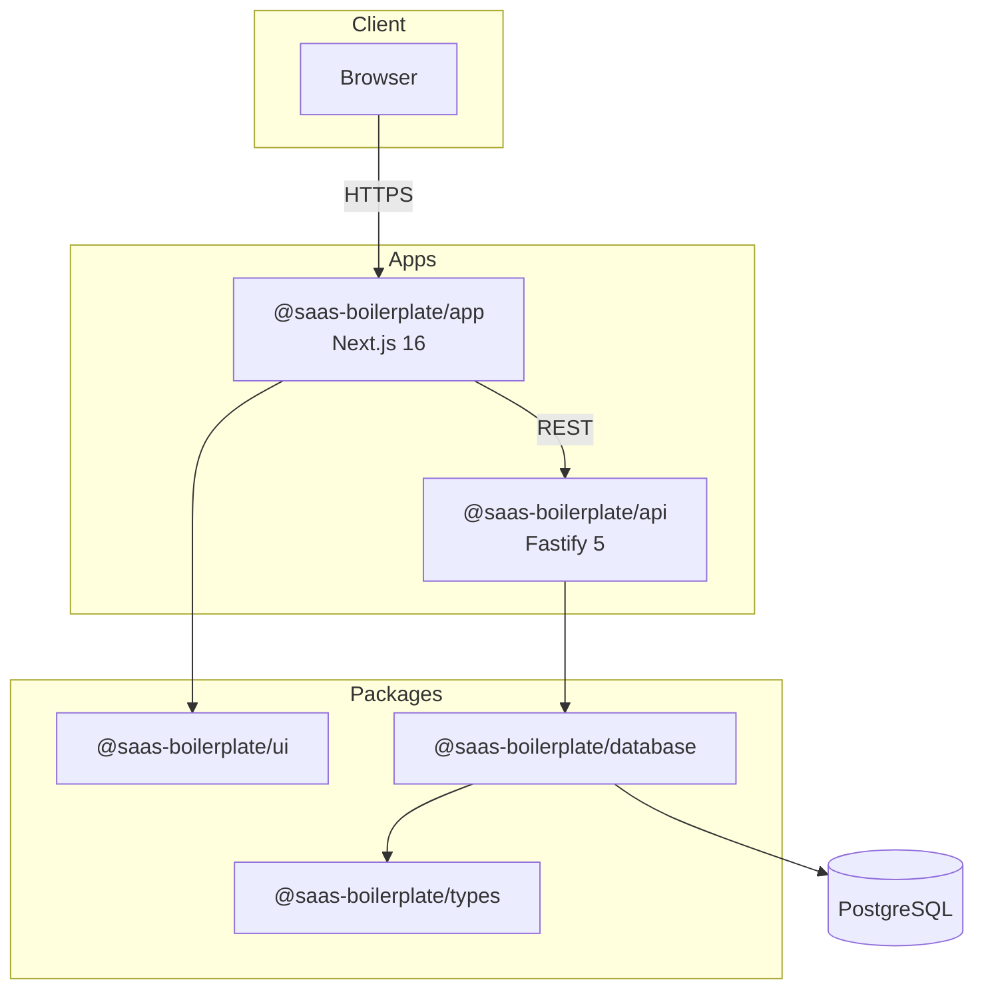

# Full Stack SaaS Boilerplate

A production-ready Turborepo monorepo with a Next.js frontend, Fastify API, and shared packages.

**Repository:** [github.com/Khalil-Bchir/full-stack-saas-boilerplate](https://github.com/Khalil-Bchir/full-stack-saas-boilerplate)

## High-level architecture



## Stack

| Layer | Technology |
| --- | --- |
| Frontend | Next.js 16 (App Router, Turbopack) |
| API | Fastify 5 |
| Database | Prisma 7 + PostgreSQL |
| UI | shadcn/ui + Tailwind CSS v4 |
| Monorepo | Turborepo 2 + pnpm 10 |
| Deploy | GitHub Actions + Kubernetes + ArgoCD |
| Tests | Vitest |

## Documentation

**Team branching & merge rules:** see [CONTRIBUTING.md](./CONTRIBUTING.md).

**Full documentation lives in [`doc/`](./doc/README.md).**

| Start here | Description |
| --- | --- |
| [Contributing / social contract](./CONTRIBUTING.md) | Branching, PRs, and no-self-merge rules |
| [PR & merge flow](./doc/setup/pr-and-merge-flow.md) | How feature → dev → staging → main works |
| [Getting Started (A–Z)](./doc/setup/getting-started.md) | Clone, install, configure, and run |
| [Environments & NODE_ENV](./doc/setup/environments-and-node-env.md) | Env files, NODE_ENV, staging/production |
| [Environment Variables](./doc/setup/environment-variables.md) | All env vars explained |
| [Development Workflow](./doc/setup/development.md) | Daily commands and conventions |
| [Testing](./doc/setup/testing.md) | Unit tests with Vitest |
| [Deployment](./doc/setup/deployment.md) | Kubernetes, ArgoCD, and Docker |
| [Architecture Overview](./doc/architecture/overview.md) | System diagram and data flow |

## Workspace packages

| Package | Purpose | README |
| --- | --- | --- |
| `@saas-boilerplate/app` | Next.js frontend | [apps/app/README.md](./apps/app/README.md) |
| `@saas-boilerplate/api` | Fastify REST API | [apps/api/README.md](./apps/api/README.md) |
| `@saas-boilerplate/database` | Prisma schema, migrations, client | [packages/database/README.md](./packages/database/README.md) |
| `@saas-boilerplate/types` | Shared Prisma-generated types | [packages/types/README.md](./packages/types/README.md) |
| `@saas-boilerplate/ui` | Shared shadcn/ui components | [packages/ui/README.md](./packages/ui/README.md) |
| `@saas-boilerplate/eslint-config` | Shared ESLint config | [packages/eslint-config/README.md](./packages/eslint-config/README.md) |
| `@saas-boilerplate/prettier-config` | Shared Prettier config | [packages/prettier-config/README.md](./packages/prettier-config/README.md) |
| `@saas-boilerplate/typescript-config` | Shared TS configs | [packages/typescript-config/README.md](./packages/typescript-config/README.md) |

## Quick start

```bash
git clone https://github.com/Khalil-Bchir/full-stack-saas-boilerplate.git
cd full-stack-saas-boilerplate
pnpm install
cp .env.example .env.development
pnpm db:push
pnpm dev
```

- Frontend: http://localhost:3000
- API: http://localhost:8000
- API health: http://localhost:8000/api/v1/health

See the [full setup guide](./doc/setup/getting-started.md) for Docker Postgres, secrets, and troubleshooting.

## Common commands

```bash
pnpm dev              # Start all dev servers
pnpm stage            # Start app & api (staging)
pnpm test             # Run unit tests
pnpm start            # Build + start app & api (production)
pnpm build            # Build all packages
pnpm lint             # Lint all workspaces
pnpm db:generate      # Regenerate Prisma client
pnpm db:push          # Push schema to database
pnpm db:studio        # Open Prisma Studio
pnpm format           # Prettier format
pnpm commit           # Conventional commit (commitizen)
```

## Project structure

```
├── apps/
│   ├── app/              Next.js frontend
│   └── api/              Fastify API
├── deploy/               Kubernetes + ArgoCD manifests
├── packages/
│   ├── database/         Prisma + PostgreSQL
│   ├── types/            Generated Prisma types
│   ├── ui/               shadcn/ui components
│   ├── eslint-config/
│   ├── prettier-config/
│   └── typescript-config/
├── doc/                  Documentation
├── patches/              pnpm patched dependencies
├── turbo.json
└── pnpm-workspace.yaml
```

## Requirements

- Node.js 20.9+ (22 recommended)
- pnpm 10+
- PostgreSQL (local Docker or remote)

## License

[MIT](./LICENSE) © [Khalil Bchir](https://github.com/Khalil-Bchir)
