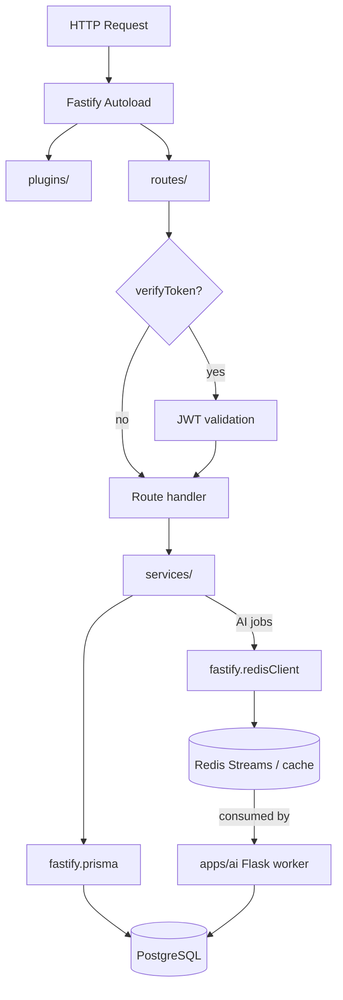

# @saas-boilerplate/api

Fastify 5 REST API for the SaaS boilerplate.

**Repository:** [github.com/Khalil-Bchir/full-stack-saas-boilerplate](https://github.com/Khalil-Bchir/full-stack-saas-boilerplate)

## Request flow



Async AI details: [AI Async Jobs (Option C)](../../doc/features/ai-async-jobs.md).

## Overview

| Item | Value |
| --- | --- |
| Framework | Fastify 5 |
| Validation | AJV + JSON Schema |
| Auth | JWT (jsonwebtoken) |
| Database | Prisma via `@saas-boilerplate/database` |
| Types | `@saas-boilerplate/types` |
| AI contracts | `@saas-boilerplate/ai-contracts` |
| Queue / cache | Redis (`REDIS_URL`) |
| Default port | `8000` |

## Directory structure

```
src/
  index.ts              Server entry + graceful shutdown
  app.ts                Autoload plugins and routes
  config.ts             Configuration
  plugins/              Fastify plugins (auto-loaded)
    authorization.ts    JWT verifyToken decorator
    prisma.ts           Database client
    redis.ts            Redis client (queue + cache)
    rate-limiter.ts     Shared limits when Redis is up
    cors.ts             CORS
    swagger.ts          OpenAPI docs
    error-handler.ts    Global errors
    ...
  routes/
    v1/
      auth/actions.ts   POST /login, /register, GET /authcheck
      users/actions.ts  User endpoints
      ai/actions.ts     Async AI jobs (Option C)
      admin/actions.ts  Admin endpoints
      common/actions.ts Health checks
    v2/actions.ts       v2 routes
  services/
    authentication.ts   Login, register, auth check
    authorization.ts    Token verification
    users.ts            User operations
    ai-jobs.ts          Enqueue + poll AI jobs
    ai-cache.ts         Redis result cache
  schemas/v1/           Request/response JSON schemas
  types/                TypeScript interfaces
  translation/          i18next locale files (en, ar)
```

## Scripts

| Script | Description |
| --- | --- |
| `pnpm dev` | Start with hot reload (`tsx watch`) |
| `pnpm stage` | Start against staging env |
| `pnpm test` | Run unit tests (Vitest) |
| `pnpm build` | Compile TypeScript to `dist/` |
| `pnpm start` | Run production build |

## Environment

| Script | Env file loaded |
| --- | --- |
| `pnpm dev` | `.env.development` |
| `pnpm stage` | `.env.staging` |
| `pnpm start` | `.env.production` |

See [Environments & NODE_ENV](../../doc/setup/environments-and-node-env.md) and [Environment Variables](../../doc/setup/environment-variables.md).

## API routes

| Method | Path | Auth | Description |
| --- | --- | --- | --- |
| `POST` | `/api/v1/auth/register` | No | Create account |
| `POST` | `/api/v1/auth/login` | No | Get JWT + user |
| `GET` | `/api/v1/auth/authcheck` | Bearer | Verify token |
| `GET` | `/api/v1/common/health` | No | Health check |

Swagger docs available at `/docs` when enabled.

## Adding a route

1. Create `src/routes/v1/<feature>/actions.ts`
2. Export a default `FastifyPluginAsync`
3. Routes auto-register under `/api/v1/<feature>/`

See [API Architecture](../../doc/features/api-architecture.md).

## Docker

```bash
docker build -t saas-api -f apps/api/Dockerfile .
```

## Related docs

- [API Architecture](../../doc/features/api-architecture.md)
- [Authentication](../../doc/features/authentication.md)
- [Deployment](../../doc/setup/deployment.md)
