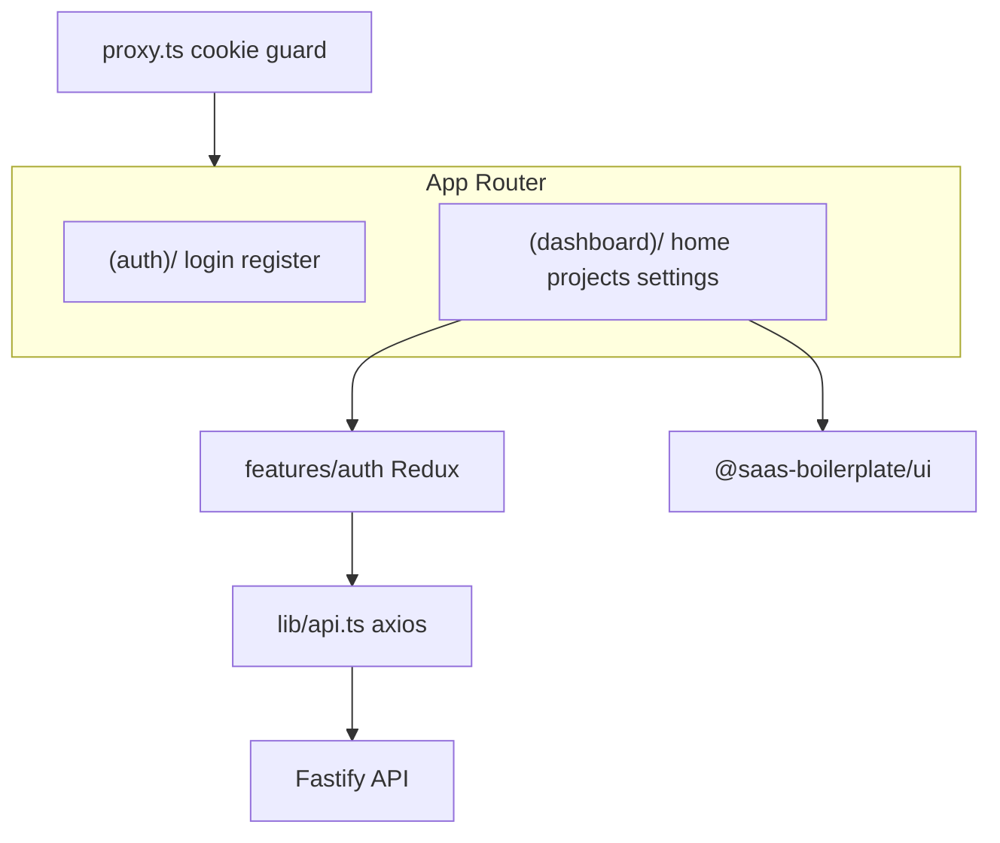

# @saas-boilerplate/app

Next.js 16 frontend for the SaaS boilerplate.

**Repository:** [github.com/Khalil-Bchir/full-stack-saas-boilerplate](https://github.com/Khalil-Bchir/full-stack-saas-boilerplate)

## App structure



## Overview

| Item | Value |
| --- | --- |
| Framework | Next.js 16 (App Router, Turbopack) |
| React | 19 |
| State | Redux Toolkit + redux-persist |
| UI | `@saas-boilerplate/ui` (shadcn/ui) |
| Styling | Tailwind CSS v4 |
| Auth guard | `src/proxy.ts` (Next.js 16 proxy convention) |
| Default port | `3000` |

## Directory structure

```
src/
  app/
    (auth)/              Public routes — login, register
    (dashboard)/         Protected routes — dashboard, projects, settings
    layout.tsx           Root layout (providers, fonts)
    globals.css          Tailwind entry + theme tokens
    error.tsx            Error boundary
    not-found.tsx        404 page
    loading.tsx          Global loading state
  components/
    auth/                Login/register forms
    dashboard/           Sidebar, nav, shell, theme toggle
    shared/              Providers, spinner
  features/
    auth/
      store/             Redux auth slice
      hooks/             Typed dispatch/selector
      schemas.ts         Zod validation
      types.ts           Auth types
  lib/
    api.ts               Axios instance (NEXT_PUBLIC_API_URL)
    auth.ts              Cookie + sessionStorage helpers
    store.ts             Redux store + persistor
  config/
    site.ts              Site metadata
  proxy.ts               Route protection (cookie check)
```

## Scripts

| Script | Description |
| --- | --- |
| `pnpm dev` | Start dev server (loads root env files) |
| `pnpm stage` | Start dev server with staging env |
| `pnpm test` | Run unit tests (Vitest) |
| `pnpm build` | Production build |
| `pnpm start` | Serve production build |
| `pnpm lint` | ESLint |

## Environment

Loaded via `dotenv-cli` from monorepo root env files. See [Environments & NODE_ENV](../../doc/setup/environments-and-node-env.md).

| Script | Env file loaded |
| --- | --- |
| `pnpm dev` | `.env` + `.env.development` |
| `pnpm stage` | `.env` + `.env.staging` |
| `pnpm build` | `.env` + `.env.production` |

Client-accessible variables must use the `NEXT_PUBLIC_` prefix:

```env
NEXT_PUBLIC_API_URL=http://localhost:8000/api/v1
```

## Route groups

| Group | Path | Access |
| --- | --- | --- |
| Auth | `/login`, `/register` | Public |
| Dashboard | `/`, `/projects`, `/settings` | Protected (cookie) |

## Conventions

- Keep `app/` pages thin — compose components, delegate logic to `features/`
- Business logic in `features/[name]/`
- Shared UI from `@saas-boilerplate/ui`
- Prisma types from `@saas-boilerplate/types` (types only, no DB client)

## Adding shadcn components

```bash
cd apps/app
pnpm dlx shadcn@latest add dialog checkbox
```

Installs into `packages/ui/`. See [UI System](../../doc/features/ui-system.md).

## Styling

Tailwind entry: `src/app/globals.css`

Must include `@source '../../../../packages/ui/src'` to scan shared UI components.

## Patches

`next-themes@0.4.6` is patched at monorepo root for React 19 compatibility. See `patches/next-themes@0.4.6.patch`.

## Related docs

- [Getting Started](../../doc/setup/getting-started.md)
- [Authentication](../../doc/features/authentication.md)
- [UI System](../../doc/features/ui-system.md)
