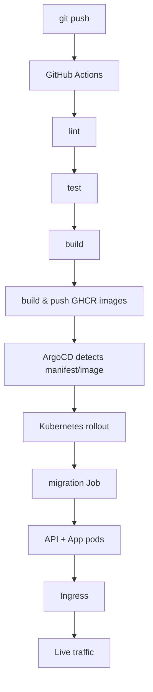
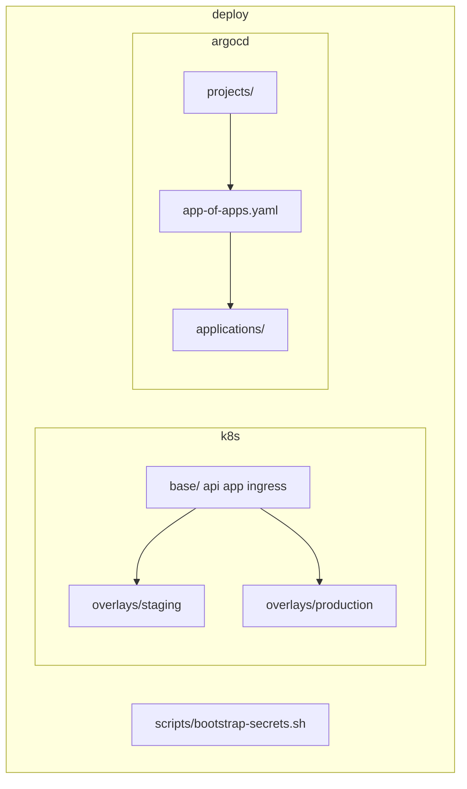

# Deployment

Kubernetes manifests and ArgoCD applications for GitOps deployment.

**Repository:** [github.com/Khalil-Bchir/full-stack-saas-boilerplate](https://github.com/Khalil-Bchir/full-stack-saas-boilerplate)

This project uses **GitHub Actions** for CI and **Kubernetes + ArgoCD** for GitOps deployment.

## End-to-end deploy flow



## CI pipeline

Workflow: `.github/workflows/ci.yml`

On every push / PR to `main` or `staging`:

1. `pnpm lint`
2. `pnpm test`
3. `pnpm build`

On push to `main` or `staging` (after CI passes):

4. Build & push `ghcr.io/khalil-bchir/saas-boilerplate-api`
5. Build & push `ghcr.io/khalil-bchir/saas-boilerplate-app`

ArgoCD then deploys the updated images to Kubernetes.

## Layout



```
deploy/
├── k8s/
│   ├── base/                 Shared manifests (api, app, ingress, migration job)
│   └── overlays/
│       ├── staging/          Namespace saas-staging
│       └── production/       Namespace saas-production
├── argocd/
│   ├── projects/             ArgoCD project
│   ├── applications/         staging + production Applications
│   └── app-of-apps.yaml      Root Application
└── scripts/
    └── bootstrap-secrets.sh  Create K8s secrets from env files
```

## Container registry

| Image | Tag (staging) | Tag (production) |
| --- | --- | --- |
| `ghcr.io/khalil-bchir/saas-boilerplate-api` | `staging` | `production` |
| `ghcr.io/khalil-bchir/saas-boilerplate-app` | `staging` | `production` |

## Quick start

### 1. Run tests and build images

```bash
pnpm test
pnpm build

docker login ghcr.io -u Khalil-Bchir
docker build -t ghcr.io/khalil-bchir/saas-boilerplate-api:staging -f apps/api/Dockerfile .
docker build -t ghcr.io/khalil-bchir/saas-boilerplate-app:staging -f apps/app/Dockerfile .
docker push ghcr.io/khalil-bchir/saas-boilerplate-api:staging
docker push ghcr.io/khalil-bchir/saas-boilerplate-app:staging
```

### 2. Create secrets

```bash
cp .env.staging.example .env.staging
chmod +x deploy/scripts/bootstrap-secrets.sh
./deploy/scripts/bootstrap-secrets.sh saas-staging .env.staging
```

For production:

```bash
cp .env.production.example .env.production
./deploy/scripts/bootstrap-secrets.sh saas-production .env.production
```

### 3. Deploy to Kubernetes

```bash
kubectl apply -k deploy/k8s/overlays/staging
kubectl -n saas-staging wait --for=condition=complete job/saas-api-migrate --timeout=120s
```

### 4. Bootstrap ArgoCD

```bash
kubectl create namespace argocd
kubectl apply -n argocd -f https://raw.githubusercontent.com/argoproj/argo-cd/stable/manifests/install.yaml
kubectl apply -f deploy/argocd/projects/
kubectl apply -f deploy/argocd/app-of-apps.yaml
```

ArgoCD syncs from:

- `staging` branch → `deploy/k8s/overlays/staging`
- `main` branch → `deploy/k8s/overlays/production`

## Ingress hosts

| Environment | Frontend | API |
| --- | --- | --- |
| Staging | `staging.saas-boilerplate.io` | `api.staging.saas-boilerplate.io` |
| Production | `app.saas-boilerplate.io` | `api.saas-boilerplate.io` |

Requires an NGINX Ingress Controller (`ingressClassName: nginx`).

## Local staging

```bash
cp .env.staging.example .env.staging
pnpm stage
```

## Full guide

See [doc/setup/deployment.md](../doc/setup/deployment.md).
