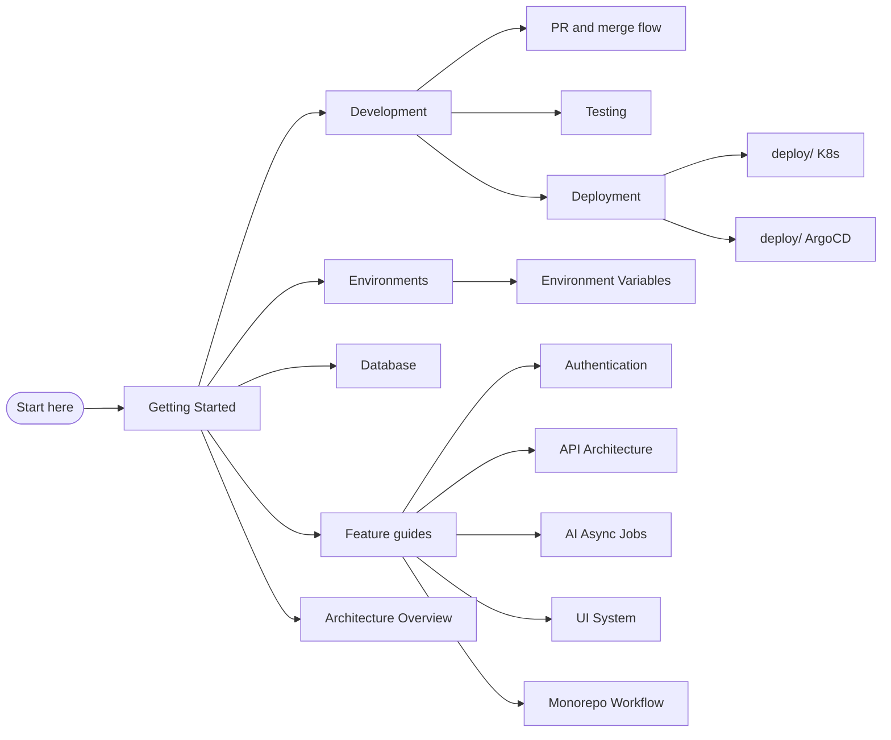

# Documentation

Central documentation for the **Full Stack SaaS Boilerplate** monorepo.

**Repository:** [github.com/Khalil-Bchir/full-stack-saas-boilerplate](https://github.com/Khalil-Bchir/full-stack-saas-boilerplate)  
**License:** [MIT](../LICENSE)

## Documentation map

## Start here

| Document | Description |
| --- | --- |
| [Getting Started (A–Z)](./setup/getting-started.md) | Clone, install, configure, and run the entire stack |
| [Environments & NODE_ENV](./setup/environments-and-node-env.md) | How env files, NODE_ENV, and per-environment commands work |
| [Environment Variables](./setup/environment-variables.md) | All env vars explained per environment |
| [Database Setup](./setup/database.md) | PostgreSQL, Prisma, migrations, and seeding |
| [Development Workflow](./setup/development.md) | Daily dev commands, Turbo, and debugging |
| [PR & merge flow](./setup/pr-and-merge-flow.md) | Feature → dev → staging → main, reviews, promotions |
| [Testing](./setup/testing.md) | Unit tests with Vitest |
| [Deployment](./setup/deployment.md) | Kubernetes, ArgoCD, and Docker |

## Practical labs

| Document | Description |
| --- | --- |
| [Practical Workflow Lab](./practical-workflow-lab.md) | Build a Project resource: Prisma → Fastify → Next.js |
| [Practical AI Lab](./practical-ai-lab.md) | Add a `SUMMARIZE` job: contracts → queue → Flask → polling UI |

## Feature guides

| Document | Description |
| --- | --- |
| [Authentication](./features/authentication.md) | JWT auth flow across API and Next.js app |
| [Monorepo Workflow](./features/monorepo-workflow.md) | Turborepo, pnpm workspaces, and package boundaries |
| [UI System](./features/ui-system.md) | shadcn/ui, Tailwind v4, theming, and styling |
| [API Architecture](./features/api-architecture.md) | Fastify plugins, routes, and validation |
| [Database Layer](./features/database-layer.md) | Prisma schema, shared types, and client usage |
| [AI Async Jobs (Option C)](./features/ai-async-jobs.md) | Redis Streams queue, Flask worker, AiJob model |

## Architecture

| Document | Description |
| --- | --- |
| [Overview](./architecture/overview.md) | High-level system diagram and data flow |

## Infrastructure

| Document | Description |
| --- | --- |
| [Deploy README](../deploy/README.md) | Kubernetes manifests and image build |
| [ArgoCD README](../deploy/argocd/README.md) | GitOps bootstrap |

## Package documentation

Each workspace has its own README with package-specific details:

| Package | Path | README |
| --- | --- | --- |
| Root monorepo | `/` | [README.md](../README.md) |
| Next.js app | `apps/app` | [apps/app/README.md](../apps/app/README.md) |
| Fastify API | `apps/api` | [apps/api/README.md](../apps/api/README.md) |
| AI worker | `apps/ai` | [apps/ai/README.md](../apps/ai/README.md) |
| AI contracts | `packages/ai-contracts` | [packages/ai-contracts/README.md](../packages/ai-contracts/README.md) |
| Database | `packages/database` | [packages/database/README.md](../packages/database/README.md) |
| Shared types | `packages/types` | [packages/types/README.md](../packages/types/README.md) |
| UI components | `packages/ui` | [packages/ui/README.md](../packages/ui/README.md) |
| ESLint config | `packages/eslint-config` | [packages/eslint-config/README.md](../packages/eslint-config/README.md) |
| Prettier config | `packages/prettier-config` | [packages/prettier-config/README.md](../packages/prettier-config/README.md) |
| TypeScript config | `packages/typescript-config` | [packages/typescript-config/README.md](../packages/typescript-config/README.md) |
