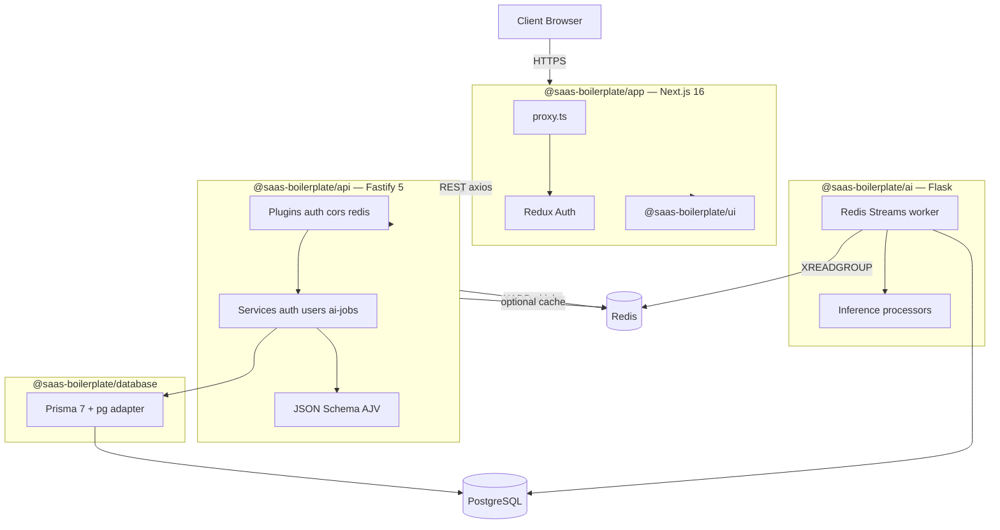
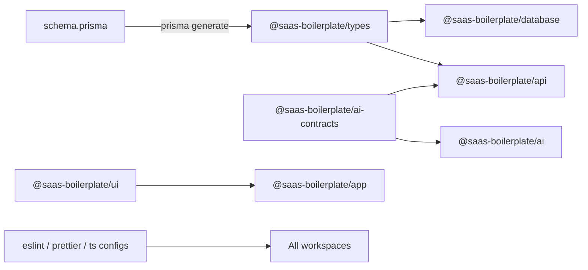
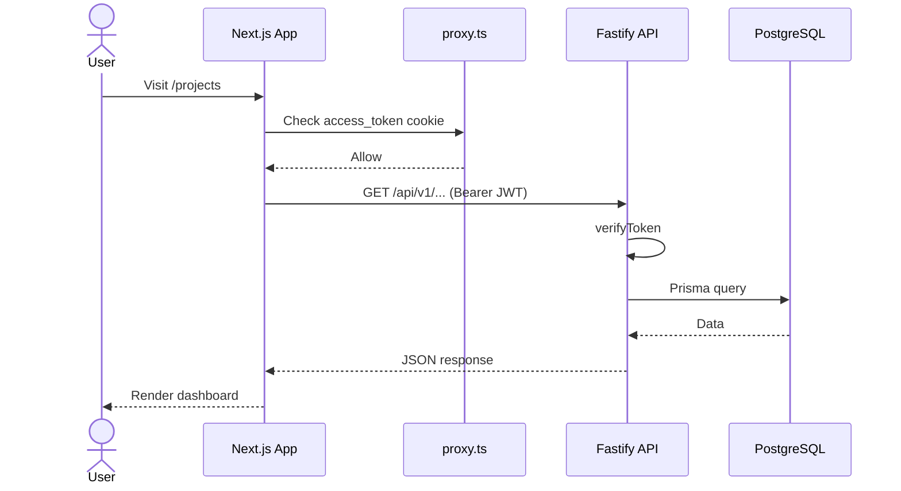
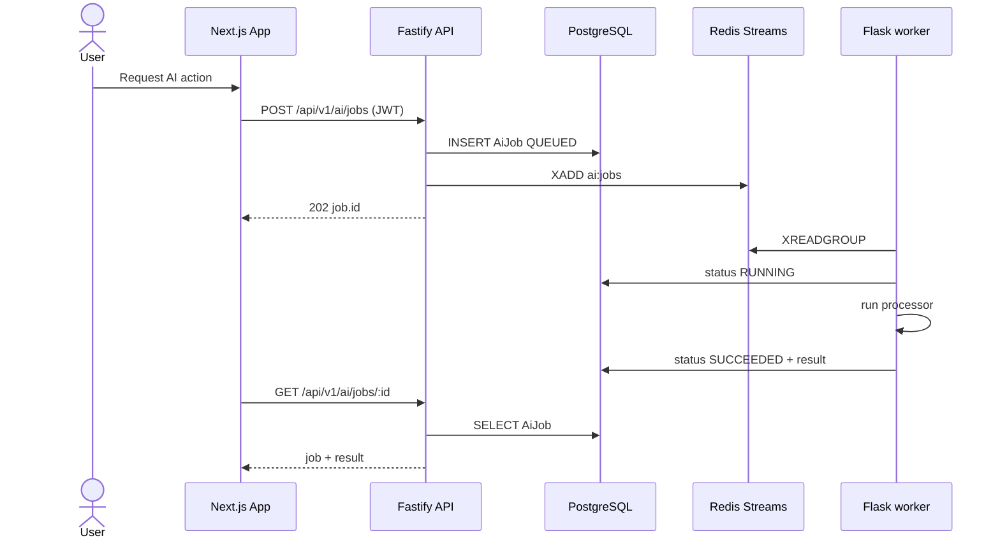
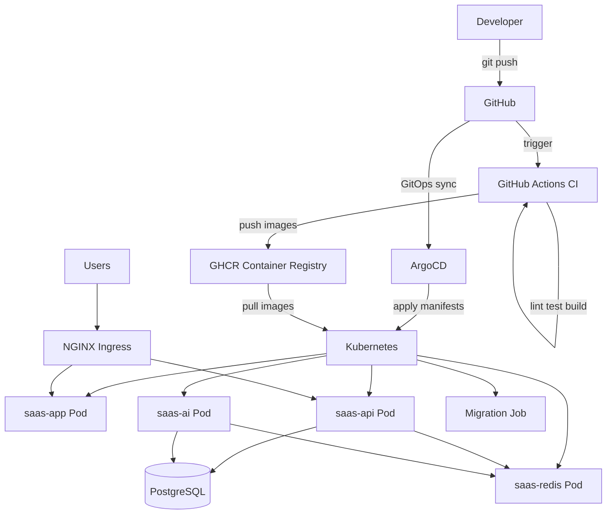

# Architecture Overview

High-level system design of the Full Stack SaaS Boilerplate.

## System diagram

## Shared packages

## Request lifecycle (authenticated product API)

## Request lifecycle (async AI job — Option C)

## Technology choices

| Concern | Choice | Why |
| --- | --- | --- |
| Monorepo | Turborepo + pnpm | Fast builds, shared packages |
| Frontend | Next.js 16 App Router | RSC, Turbopack, production-ready |
| API | Fastify 5 | Performance, plugin ecosystem |
| AI worker | Flask + Gunicorn | Python inference, async jobs |
| Queue / cache | Redis 7 Streams | Job delivery + optional result cache |
| ORM | Prisma 7 | Type-safe queries, migrations |
| UI | shadcn/ui | Own the code, Radix accessibility |
| Auth | JWT + cookie proxy | Simple, extensible |
| Styling | Tailwind v4 | Utility-first, CSS variables |

## Deployment topology

| Environment | Frontend | API |
| --- | --- | --- |
| Staging | `staging.saas-boilerplate.io` | `api.staging.saas-boilerplate.io` |
| Production | `app.saas-boilerplate.io` | `api.saas-boilerplate.io` |

| Image | Role |
| --- | --- |
| `ghcr.io/khalil-bchir/saas-boilerplate-api` | Fastify product API |
| `ghcr.io/khalil-bchir/saas-boilerplate-app` | Next.js frontend |
| `ghcr.io/khalil-bchir/saas-boilerplate-ai` | Flask AI worker |
| `redis:7.4-alpine` | In-cluster Redis (not built by CI) |

AI and Redis are ClusterIP-only (not on Ingress). See [Deployment](../setup/deployment.md), [AI Async Jobs](../features/ai-async-jobs.md), and [deploy/README.md](../../deploy/README.md).

## Extension points

| Feature | Where to extend |
| --- | --- |
| New pages | `apps/app/src/app/` |
| New API endpoints | `apps/api/src/routes/v1/` |
| New DB models | `packages/database/prisma/schema.prisma` |
| New UI components | `pnpm dlx shadcn add` from `apps/app` |
| New shared types | Auto-generated from Prisma schema |
| Admin features | `apps/api/src/routes/v1/admin/` |
| AI job contracts | `packages/ai-contracts` |
| AI processors | `apps/ai/app/processors/` |
| AI enqueue / poll API | `apps/api/src/routes/v1/ai/` |
