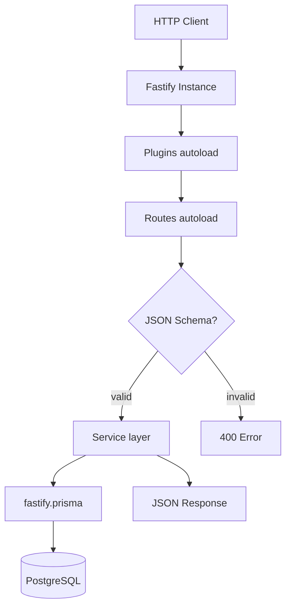
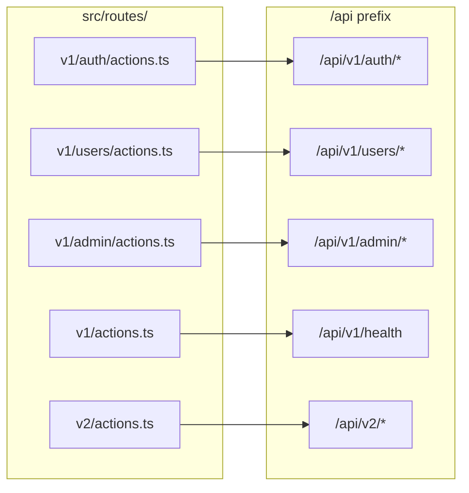

# API Architecture

Fastify 5 REST API design and conventions.

## Request flow



## Entry point

```
apps/api/src/
  index.ts          # Server bootstrap, listen, graceful shutdown
  app.ts            # Plugin + route autoload registration
  config.ts         # App configuration
  plugins/          # Fastify plugins (auto-loaded)
  routes/           # Route modules (auto-loaded)
  services/         # Business logic
  schemas/v1/       # JSON Schema validation
  types/            # TypeScript types
  translation/      # i18next locale files
```

## Server bootstrap

`index.ts`:

1. Creates Fastify instance with AJV validation
2. Registers `app.ts` (plugins + routes)
3. Listens on `SERVER_HOST:SERVER_PORT`
4. Handles graceful shutdown via `close-with-grace`

## Plugin autoload

Plugins in `src/plugins/` register automatically:

| Plugin | Purpose |
| --- | --- |
| `prisma` | Attach `fastify.prisma` client |
| `authorization` | JWT `verifyToken` decorator |
| `cors` | Cross-origin requests |
| `helmet` | Security headers |
| `cookie` | Cookie parsing/signing |
| `compress` | Response compression |
| `rate-limit` | Request rate limiting |
| `swagger` | OpenAPI documentation |
| `i18next` | Internationalization |
| `error-handler` | Global error formatting |
| `sensible` | HTTP error helpers |
| `under-pressure` | Health/backpressure |

## Route autoload



### Autohooks

Files named `autohooks.ts` in route directories apply hooks to all routes in that folder:

- `v1/users/autohooks.ts` — user route guards
- `v1/admin/autohooks.ts` — admin-only access

## Adding a new route

1. **Create route file** — `src/routes/v1/projects/actions.ts`:

```ts
import { FastifyPluginAsync } from 'fastify';

const routes: FastifyPluginAsync = async (fastify) => {
  fastify.get('/', async (request, reply) => {
    return { projects: [] };
  });
};

export default routes;
```

2. **Add schema** (optional) — `src/schemas/v1/projects.ts`

3. **Add service** (optional) — `src/services/projects.ts`

Route is available at `GET /api/v1/projects/` automatically.

## Validation

Schemas use AJV via Fastify's built-in validator:

```ts
fastify.post('/login', { schema: loginSchema }, handler);
```

Schemas defined in `src/schemas/v1/` using `fluent-json-schema` or plain JSON Schema.

## Services layer

Business logic lives in `src/services/`:

| Service | Responsibility |
| --- | --- |
| `authentication.ts` | Register, login, auth check |
| `authorization.ts` | JWT verify, token decode |
| `users.ts` | User CRUD |

Services receive `prisma` via constructor injection.

## Authentication on routes

```ts
fastify.get('/protected', {
  preHandler: [fastify.verifyToken],
}, async (request, reply) => {
  const user = request.loggedUser;
  return { user };
});
```

## Internationalization

Translations in `src/translation/en/` and `src/translation/ar/`.

Use in handlers: `request.t('key')`

## Error handling

Global error handler in `plugins/error-handler.ts` formats consistent error responses.

## Swagger / OpenAPI

When the swagger plugin is enabled, docs are available at `/docs`.

## Development

```bash
pnpm --filter @saas-boilerplate/api dev
```

Uses `tsx watch` with hot reload and `pino-pretty` logging.

## Production

```bash
pnpm build:api
pnpm --filter @saas-boilerplate/api start
```

Runs compiled JavaScript from `dist/index.js`.

## Docker

```bash
docker build -t saas-api -f apps/api/Dockerfile .
```

See [Deployment](../setup/deployment.md).
