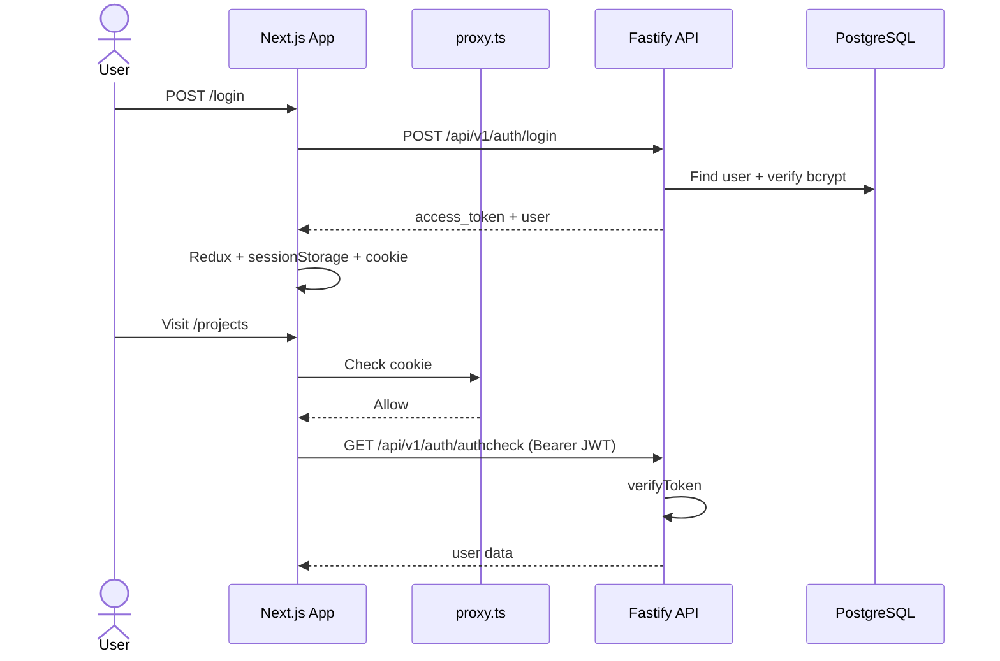
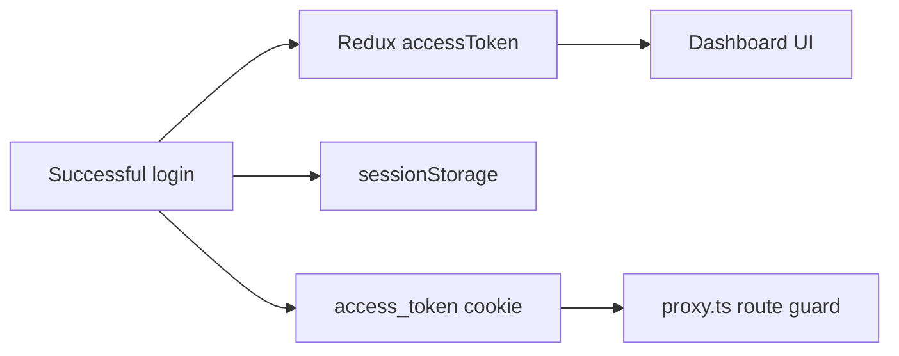

# Authentication

End-to-end authentication flow between the Next.js frontend and Fastify API.

## Overview



## Registration

**Frontend**: `apps/app/src/components/auth/register-form.tsx`

**API**: `POST /api/v1/auth/register`

```json
{
  "name": "Jane Doe",
  "email": "jane@example.com",
  "password": "securepassword"
}
```

Passwords are hashed with **bcrypt** before storage.

## Login

**Frontend**: `apps/app/src/components/auth/login-form.tsx`

**API**: `POST /api/v1/auth/login`

Response:

```json
{
  "access_token": "eyJhbG...",
  "user": {
    "id": "clx...",
    "name": "Jane Doe",
    "email": "jane@example.com"
  }
}
```

### Client-side session storage



On successful login (`features/auth/store/auth-slice.ts`):

1. Token stored in **Redux** (`accessToken`)
2. Token stored in **sessionStorage** (`access_token`)
3. User stored in **sessionStorage** (`user`)
4. Token written to **cookie** (`access_token`) for route proxy

See `apps/app/src/lib/auth.ts`.

## Route protection (Next.js)

**File**: `apps/app/src/proxy.ts`

| Condition | Action |
| --- | --- |
| No cookie + protected route | Redirect to `/login` |
| Has cookie + auth route (`/login`, `/register`) | Redirect to `/` |
| Otherwise | Continue |

> This is an **optimistic cookie check** only — it does not verify JWT signatures. Real authorization happens on the API.

## API authorization

**Plugin**: `apps/api/src/plugins/authorization.ts`

Protected routes use `preHandler: [fastify.verifyToken]`:

1. Extract `Authorization: Bearer <token>` header
2. Verify JWT with `ACCESS_TOKEN_SECRET`
3. Attach decoded user to `request.loggedUser`

Example protected route:

```
GET /api/v1/auth/authcheck
Authorization: Bearer eyJhbG...
```

## Logout

**Frontend**: dispatches `logout()` action which:

- Clears Redux state
- Removes sessionStorage entries
- Clears the `access_token` cookie

## Environment variables

| Variable | Used by |
| --- | --- |
| `ACCESS_TOKEN_SECRET` | API — JWT signing |
| `ACCESS_TOKEN_TTL` | API — token expiry |
| `COOKIE_SECRET` | API — cookie plugin |

## Security notes

- Never store raw passwords — only bcrypt hashes
- JWT secret must be long and random in production
- `NEXT_PUBLIC_*` vars must not contain secrets
- Proxy cookie check is UX-only; always validate tokens server-side
- Consider httpOnly cookies for production hardening

## Extending auth

Common next steps:

- Refresh tokens
- Email verification
- OAuth providers (Clerk, Auth0, etc.)
- Role-based access control (extend User model + admin autohooks)

Admin routes already have a hook scaffold at `apps/api/src/routes/v1/admin/autohooks.ts`.
