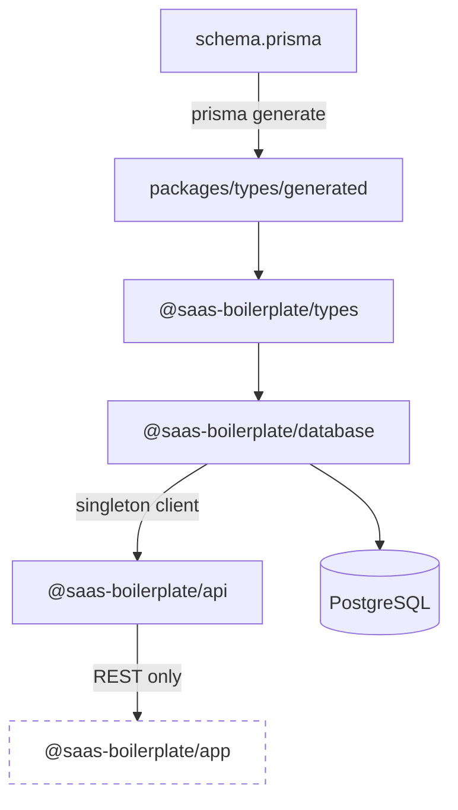

# Database Layer

Prisma 7 setup, shared types, and how data flows through the monorepo.

## Data flow



The frontend **never** connects to the database directly. All data access goes through the API.

## packages/database

| File | Purpose |
| --- | --- |
| `prisma/schema.prisma` | Model definitions |
| `prisma/migrations/` | SQL migration history |
| `prisma.config.ts` | Prisma 7 CLI configuration |
| `src/client.ts` | Singleton `PrismaClient` with `@prisma/adapter-pg` |
| `src/index.ts` | Package exports |
| `src/seed/` | Seed scripts per environment |

### Client singleton

```ts
import { prisma } from '@saas-boilerplate/database';
```

Uses `globalThis` caching in development to prevent connection exhaustion during hot reload.

### Prisma 7 adapter

Uses the official PostgreSQL driver adapter:

```ts
import { PrismaPg } from '@prisma/adapter-pg';
import { PrismaClient } from '@saas-boilerplate/types';

const adapter = new PrismaPg({ connectionString: process.env.DATABASE_URL });
const prisma = new PrismaClient({ adapter });
```

## packages/types

Re-exports the generated Prisma client:

```ts
// packages/types/src/index.ts
export * from './generated/prisma/client.js';
```

Import anywhere:

```ts
import { User, PrismaClient, Prisma } from '@saas-boilerplate/types';
```

### Build dependency

Turbo ensures `db:generate` runs before `types#build`:

```json
"build": {
  "dependsOn": ["^build", "^db:generate"]
}
```

## Schema changes

1. Edit `packages/database/prisma/schema.prisma`
2. Run `pnpm db:generate`
3. Apply changes:
   - Dev: `pnpm db:push` (quick)
   - Prod: `pnpm --filter @saas-boilerplate/database db:migrate:dev` then `db:migrate:prod`

4. Types auto-update in `packages/types/src/generated/`

## Seeding

Seed scripts in `packages/database/src/seed/`:

| Script | Command |
| --- | --- |
| Development | `pnpm --filter @saas-boilerplate/database db:seed:dev` |
| Staging | `pnpm --filter @saas-boilerplate/database db:seed:staging` |
| Production | `pnpm --filter @saas-boilerplate/database db:seed:prod` |

Uses `@faker-js/faker` for test data generation.

## API integration

The Prisma plugin decorates Fastify:

```ts
// plugins/prisma.ts
fastify.decorate('prisma', prisma);
```

Used in services:

```ts
const authService = new AuthenticationService({ prisma: fastify.prisma });
```

## Best practices

- Keep schema as the single source of truth
- Never import `@saas-boilerplate/database` in the frontend
- Use migrations for production; `db push` for local prototyping only
- Regenerate types after every schema change
- Add indexes for frequently queried fields

See also: [Database Setup](../setup/database.md)
