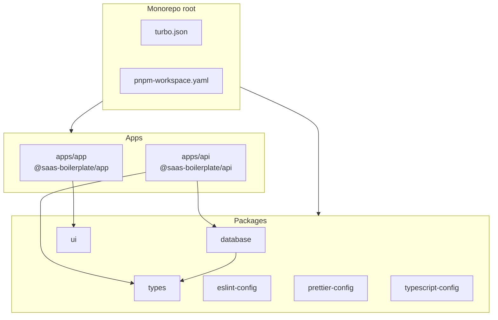
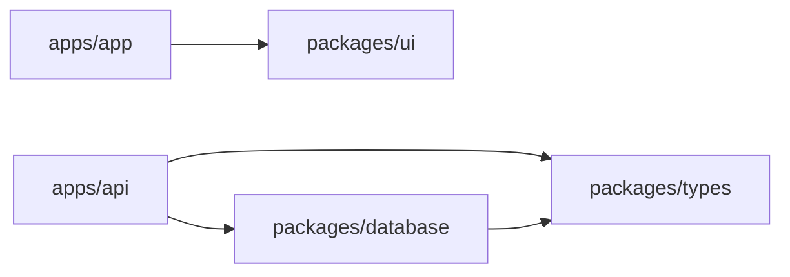
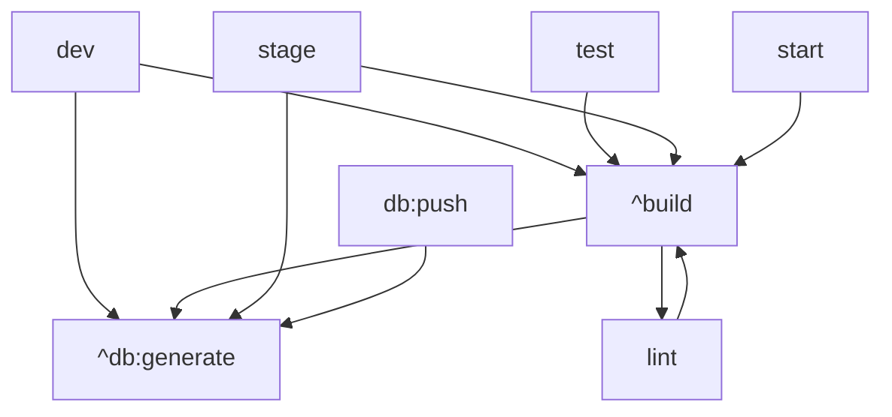

# Monorepo Workflow

How Turborepo and pnpm workspaces organize this boilerplate.

## Structure



## Dependency graph



## pnpm workspaces

Defined in `pnpm-workspace.yaml`:

```yaml
packages:
  - "apps/*"
  - "packages/*"
```

All internal packages use the `@saas-boilerplate/*` scope and are linked via `workspace:*` in `package.json`.

## Turborepo tasks

Configured in `turbo.json`:



| Task | Behavior |
| --- | --- |
| `build` | Depends on `^build` and `^db:generate` |
| `dev` | Persistent, no cache, depends on `^build` + `^db:generate` |
| `lint` | Depends on `^build` |
| `db:generate` | No cache, outputs to `packages/types/src/generated/` |
| `db:push` | No cache, depends on `^db:generate` |

### Global env vars (cache keys)

- `NODE_ENV`
- `DATABASE_URL`
- `NEXT_PUBLIC_API_URL`

## Package boundaries

| Rule | Reason |
| --- | --- |
| App imports UI from `@saas-boilerplate/ui` | Shared design system |
| App does NOT import `@saas-boilerplate/database` directly | Database access only via API |
| API imports types from `@saas-boilerplate/types` | Shared type safety |
| API imports client from `@saas-boilerplate/database` | Single Prisma instance |
| Prisma generates into `packages/types` | One source of truth for models |

## Adding a new workspace package

1. Create `packages/my-package/` with `package.json` (`name: @saas-boilerplate/my-package`)
2. Add `"@saas-boilerplate/my-package": "workspace:*"` to consumer `package.json`
3. Run `pnpm install`
4. Add build script if needed; Turbo picks it up automatically

## Adding a new app

1. Create `apps/my-app/` with its own `package.json`
2. Ensure it is covered by `pnpm-workspace.yaml` (`apps/*`)
3. Add Turbo task overrides in `turbo.json` if needed

## Version management

- **pnpm overrides** in root `package.json` for shared transitive deps
- **patchedDependencies** for packages needing local patches (e.g. `next-themes`)

## Commit conventions

Husky + commitlint enforce conventional commits. Use `pnpm commit` for guided messages.
