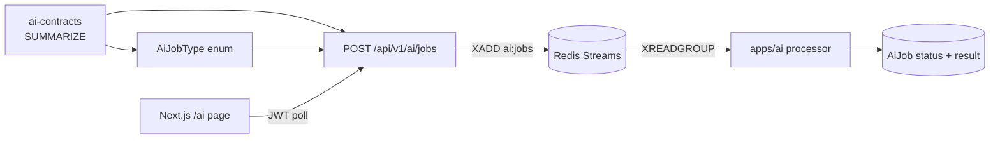

# Practical AI Lab — Contracts to Queue to Worker to UI

Hands-on exercises for the **Option C** async AI integration. Work through the modules in order. Each module references the official docs and ends with **verification steps** you can run yourself.

> **Scope:** local development only — Redis, Fastify job APIs, Flask worker, contracts, and a small Next.js polling UI. Kubernetes deployment is intentionally excluded.

**Suggested feature:** add a user-facing **`SUMMARIZE`** job type end-to-end. Authenticated users enqueue text, the Flask worker returns a stub summary, and a dashboard page polls until `SUCCEEDED`.

---

## Before you start

### Required reading

| Order | Document | Why |
| ----- | -------- | --- |
| 1 | [Getting Started](./setup/getting-started.md) | Clone, env, Postgres, Redis, `pnpm dev` |
| 2 | [Architecture Overview](./architecture/overview.md) | App → API → Redis → AI → Postgres |
| 3 | [AI Async Jobs (Option C)](./features/ai-async-jobs.md) | Full design: queue, statuses, APIs |
| 4 | [API Architecture](./features/api-architecture.md) | Routes, services, validation |
| 5 | [Database Layer](./features/database-layer.md) | `AiJob` as durable source of truth |
| 6 | [Monorepo Workflow](./features/monorepo-workflow.md) | Package boundaries for AI |
| 7 | [Authentication](./features/authentication.md) | JWT on `/api/v1/ai/*` |
| 8 | [Development Workflow](./setup/development.md) | `infra:up`, logs, daily commands |
| 9 | [`apps/ai` README](../apps/ai/README.md) | Flask worker layout |
| 10 | [`packages/ai-contracts` README](../packages/ai-contracts/README.md) | Shared types & stream names |

### What you will build



A `SUMMARIZE` job belongs to a user. The browser never talks to Flask. Fastify authenticates, persists `AiJob`, and enqueues; the worker updates status asynchronously.

### Design rules (do not break these)

| Allowed | Not allowed |
| ------- | ----------- |
| App → Fastify `/api/v1/ai/jobs` | App → Flask `:5000` |
| API → Redis Streams + Postgres | API → live model inference |
| AI worker → Postgres SQL for `AiJob` | AI worker → public auth / product CRUD |
| Shared shapes in `ai-contracts` | Model weights inside Fastify |

---

## Module 0 — Environment check

**Goal:** confirm Redis, API, and the AI worker are healthy before changing code.

### Task 0.1 — Boot the stack

```bash
pnpm install
cp .env.example .env.development   # skip if already done
pnpm db:generate
pnpm db:push                       # or: pnpm --filter @saas-boilerplate/database db:migrate:dev
pnpm dev                           # Redis + AI + API + Next.js
```

**Verify:**

| Check | Command / action | Expected |
| ----- | ---------------- | -------- |
| API health | `curl http://localhost:8000/api/v1/health` | `status: ok`, `redis: up` |
| AI health | `curl http://localhost:5000/health` | `status: ok`, `redis: true` |
| AI ready | `curl http://localhost:5000/ready` | ready / consumer group OK |
| Frontend | Open [http://localhost:3000](http://localhost:3000) | App loads |
| Existing AI tests | `pnpm --filter @saas-boilerplate/api test` | `ai-jobs` tests pass |

If Redis is down, enqueue returns `503` with `AI_QUEUE_UNAVAILABLE`. Fix with `pnpm infra:up` and check `.env.development` has `REDIS_URL`.

### Task 0.2 — Trace an existing job (no code changes)

Answer these by reading the codebase:

1. Where is `AiJob` defined in Prisma?
2. Which Fastify file enqueues with Redis `XADD`?
3. Which Flask file maps job types to processors?
4. Why must the Next.js app **not** call `http://localhost:5000`?

Write answers in personal notes. Compare with [AI Async Jobs](./features/ai-async-jobs.md) and [Monorepo Workflow](./features/monorepo-workflow.md).

**Pass criteria:** all four answers match the paths/patterns in those docs.

### Task 0.3 — Run one real `EMBED` job

```bash
TOKEN=$(curl -s -X POST http://localhost:8000/api/v1/auth/login \
  -H 'Content-Type: application/json' \
  -d '{"email":"you@example.com","password":"yourpassword"}' | jq -r .access_token)

JOB_ID=$(curl -s -X POST http://localhost:8000/api/v1/ai/jobs \
  -H "Authorization: Bearer $TOKEN" \
  -H 'Content-Type: application/json' \
  -d '{"type":"EMBED","payload":{"text":"lab hello"},"idempotencyKey":"lab-embed-001"}' \
  | jq -r .job.id)

# poll until SUCCEEDED or FAILED
curl -s http://localhost:8000/api/v1/ai/jobs/$JOB_ID \
  -H "Authorization: Bearer $TOKEN" | jq
```

**Pass criteria:**

- [ ] `POST` returns `202` with `status: "QUEUED"` (or `SUCCEEDED` if cache hit)
- [ ] Poll eventually shows `SUCCEEDED` with `result.embedding`
- [ ] Same `idempotencyKey` again returns the **same** `job.id`

---

## Module 1 — Contracts + database

**Read:** [AI Async Jobs §5–6, §13](./features/ai-async-jobs.md), [`packages/ai-contracts` README](../packages/ai-contracts/README.md)

**Reference patterns:** existing `EMBED` / `MATCH` in contracts and Prisma.

### Task 1.1 — Add `SUMMARIZE` to contracts

Edit `packages/ai-contracts/src/index.ts`:

1. Add `'SUMMARIZE'` to `AI_JOB_TYPES`
2. Rebuild so the API can import it:

```bash
pnpm --filter @saas-boilerplate/ai-contracts build
pnpm --filter @saas-boilerplate/ai-contracts test
```

Optionally add a short note in `packages/ai-contracts/README.md` listing `SUMMARIZE` as a job type.

### Task 1.2 — Extend the Prisma enum

Edit `packages/database/prisma/schema.prisma`:

```prisma
enum AiJobType {
  ANALYZE_VIDEO
  VERIFY_IDENTITY
  EMBED
  MATCH
  SUMMARIZE
}
```

Apply locally:

```bash
pnpm db:generate
pnpm db:push
# Prefer a migration when you want a durable history:
# pnpm --filter @saas-boilerplate/database db:migrate:dev
```

**Verify:**

```bash
pnpm db:studio
```

- [ ] `AiJobType` includes `SUMMARIZE`
- [ ] Generated types under `packages/types` include the new enum value

### Task 1.3 — Boundary check (written)

Answer: *Why does adding a job type start in `ai-contracts` and Prisma, not only in Flask?*

**Pass criteria:** you explain that Fastify validates `type` against contracts/schema, Postgres stores the enum, and the worker must recognize the same string — all three must stay in sync.

---

## Module 2 — Flask processor

**Read:** [AI Async Jobs §8](./features/ai-async-jobs.md), [`apps/ai` README](../apps/ai/README.md)

**Reference patterns:**

- `apps/ai/app/processors/embed.py`
- `apps/ai/app/processors/__init__.py`
- `apps/ai/tests/test_processors.py`

### Task 2.1 — Implement `process_summarize`

Create `apps/ai/app/processors/summarize.py` with a **deterministic stub** (real models come later):

| Input (`payload`) | Output (`result`) |
| ----------------- | ----------------- |
| `text` (string) | `ok: true`, `processor: "summarize"` |
| optional `maxSentences` | `summary` — first N sentences or truncated text |
| | `charCount` — length of input |

Keep it pure Python (no network calls) so tests stay fast and offline.

### Task 2.2 — Register the processor

In `apps/ai/app/processors/__init__.py`, map:

```python
"SUMMARIZE": process_summarize,
```

### Task 2.3 — Pytest

Extend `apps/ai/tests/test_processors.py` (or add `test_summarize.py`):

1. Empty / missing `text` still returns a stable structure
2. Known input → expected `summary` substring
3. `get_processor("SUMMARIZE")` returns your function

```bash
cd apps/ai
python -m venv .venv && source .venv/bin/activate   # once
pip install -r requirements-dev.txt
pytest -q
```

**Pass criteria:** new processor tests pass.

### Task 2.4 — Rebuild / restart the worker

If AI runs via Compose:

```bash
pnpm infra:down
pnpm infra:up
pnpm infra:logs   # confirm worker starts without import errors
```

If you run the worker locally outside Docker, restart `python -m app.entrypoint`.

---

## Module 3 — API surface

**Read:** [API Architecture](./features/api-architecture.md), [AI Async Jobs §7](./features/ai-async-jobs.md)

**Reference patterns:**

- Routes: `apps/api/src/routes/v1/ai/actions.ts`
- Autohooks: `apps/api/src/routes/v1/ai/autohooks.ts`
- Service: `apps/api/src/services/ai-jobs.ts`
- Schema: `apps/api/src/schemas/v1/ai.ts`

The enqueue / poll routes already exist. For `SUMMARIZE` you mainly **teach the API the new enum value**.

### Task 3.1 — Update Fastify JSON Schema

In `apps/api/src/schemas/v1/ai.ts`, add `'SUMMARIZE'` to `aiJobTypeEnum` (create + response `type` enums).

Keep tags, `401` / `404` / `503` blocks as-is.

### Task 3.2 — Optional cache policy (written + tiny code)

`EMBED` / `MATCH` can short-circuit from Redis cache in `AiJobsService.createJob`.

Decide:

- Should `SUMMARIZE` be cacheable like `EMBED`?
- If yes, add `SUMMARIZE` next to `EMBED` / `MATCH` in the cache branch of `ai-jobs.ts` and in `cacheJobResult` if applicable.
- If no, document why (e.g. summaries may depend on changing prompts).

**Lab default:** make `SUMMARIZE` cacheable — same text → same stub result.

### Task 3.3 — Manual API verification

```bash
TOKEN=...   # from login

JOB_ID=$(curl -s -X POST http://localhost:8000/api/v1/ai/jobs \
  -H "Authorization: Bearer $TOKEN" \
  -H 'Content-Type: application/json' \
  -d '{"type":"SUMMARIZE","payload":{"text":"Matchy connects freelancers. It uses async AI jobs.","maxSentences":1},"idempotencyKey":"lab-summarize-001"}' \
  | jq -r .job.id)

sleep 2
curl -s http://localhost:8000/api/v1/ai/jobs/$JOB_ID \
  -H "Authorization: Bearer $TOKEN" | jq

curl -s 'http://localhost:8000/api/v1/ai/jobs?limit=5' \
  -H "Authorization: Bearer $TOKEN" | jq
```

**Pass criteria:**

- [ ] `POST` without JWT → `401`
- [ ] `POST` with `type: "NOT_A_JOB"` → `400`
- [ ] Valid `SUMMARIZE` → `202`, then poll → `SUCCEEDED` with `result.summary`
- [ ] Redis stopped (`pnpm infra:down`) → enqueue → `503` `AI_QUEUE_UNAVAILABLE` (bring infra back after)

### Task 3.4 — Service unit test

Extend `apps/api/src/services/ai-jobs.test.ts` (or add a focused case):

1. Creating a `SUMMARIZE` job calls `prisma.aiJob.create` with `type: 'SUMMARIZE'`
2. Missing Redis still throws / surfaces `503`

```bash
pnpm --filter @saas-boilerplate/api test
```

**Pass criteria:** AI job tests remain green with your additions.

---

## Module 4 — Frontend polling UI

**Read:** [UI System](./features/ui-system.md), [Authentication](./features/authentication.md)

**Reference patterns:**

- API client: `apps/app/src/lib/api.ts`
- Auth slice: `apps/app/src/features/auth/store/auth-slice.ts`
- Dashboard nav: `apps/app/src/components/dashboard/nav-main.tsx`

There is **no** AI feature folder yet — you create one.

### Task 4.1 — Feature module

Create:

```
apps/app/src/features/ai/
  types.ts
  api.ts
  schemas.ts
  store/
    ai-slice.ts
```

`types.ts`:** mirror `AiJobResponse` fields you need (`id`, `type`, `status`, `payload`, `result`, `error`, timestamps). Prefer importing shared types from `@saas-boilerplate/ai-contracts` when practical.

`schemas.ts`:** Zod form schema — `text` min 1 character, optional `maxSentences` (positive int).

`api.ts`:**

| Function | HTTP |
| -------- | ---- |
| `createJob(body)` | `POST /ai/jobs` |
| `getJob(id)` | `GET /ai/jobs/:id` |
| `listJobs(limit?)` | `GET /ai/jobs` |

Send `Authorization: Bearer <token>` (same pattern as other authenticated features).

### Task 4.2 — Zod test

Create `apps/app/src/features/ai/schemas.test.ts`:

- [ ] Valid text passes
- [ ] Empty text fails
- [ ] Invalid `maxSentences` fails

```bash
pnpm --filter @saas-boilerplate/app test
```

### Task 4.3 — Redux slice + polling

In `ai-slice.ts`:

| Thunk / action | Behavior |
| -------------- | -------- |
| `enqueueSummarize` | `POST` with `type: "SUMMARIZE"` |
| `fetchJob` | `GET` by id |
| `fetchJobs` | list recent jobs |
| polling helper | while status is `QUEUED` or `RUNNING`, re-fetch every 1–2s; stop on `SUCCEEDED` / `FAILED` |

Handle `pending` / `fulfilled` / `rejected`. Register the reducer in `apps/app/src/lib/store.ts`.

> **Hint:** keep polling in the page with `useEffect` + `setInterval`, or inside the slice with a clear cancel path on unmount. Cap polls (e.g. 60 attempts) so a stuck worker cannot spin forever.

### Task 4.4 — Build `/ai` (or `/tools/ai`) page

Add a dashboard route, e.g. `apps/app/src/app/(dashboard)/ai/page.tsx`:

1. Textarea + submit for summarize
2. Show current job status (`QUEUED` → `RUNNING` → `SUCCEEDED`)
3. Render `result.summary` when done
4. List recent jobs for the user
5. Loading and error states
6. Link from `nav-main.tsx`

Use `@saas-boilerplate/ui` components (`Button`, `Input` / `Textarea`, `Card`, `Label`).

**Verify in browser:**

1. Log in at [http://localhost:3000/login](http://localhost:3000/login)
2. Open your AI page
3. Submit text — status advances without refreshing manually
4. Summary appears from the stub processor
5. Refresh — job still listed via `GET /ai/jobs`
6. Log out — page redirects to login

**Pass criteria:** enqueue + poll loop works in the UI with **zero** Flask or Redis imports in `apps/app`.

---

## Module 5 — End-to-end integration checklist

| Step | Action | Expected |
| ---- | ------ | -------- |
| 1 | `pnpm dev` running | Redis + AI + API + app up; no startup errors |
| 2 | Login | JWT issued |
| 3 | UI submit summarize | Job appears `QUEUED`/`RUNNING` |
| 4 | Wait | UI shows `SUCCEEDED` + summary |
| 5 | `curl` `GET /api/v1/ai/jobs/:id` | Same result JSON |
| 6 | `pnpm db:studio` | `AiJob` row with `type=SUMMARIZE`, correct `userId` |
| 7 | Repeat same `idempotencyKey` via curl | Same `job.id` |
| 8 | Second user lists jobs | Does **not** see first user's jobs |
| 9 | `pnpm --filter @saas-boilerplate/api test` | Green |
| 10 | `cd apps/ai && pytest -q` | Green |
| 11 | `pnpm lint` | No new lint errors |

### Task 5.1 — Ownership reflection

Explain in your notes how the API enforces per-user job access. Point to `getJobForUser` / `listJobsForUser` (or equivalent) and why `userId` comes from the JWT, not the request body.

**Pass criteria:** you can name the service methods and the autohook that runs `verifyToken`.

---

## Module 6 — Architecture quiz

No code required.

### Q1 — Responsibility matrix

Fill in **owns** vs **does not own**:

| Layer | Inference | JWT auth | `AiJob` write | Redis `XADD` | Poll UX |
| ----- | --------- | -------- | ------------- | ------------ | ------- |
| `apps/app` | ? | ? | ? | ? | ? |
| `apps/api` | ? | ? | ? | ? | ? |
| `apps/ai` | ? | ? | ? | ? | ? |

### Q2 — Why both Postgres and Redis?

One sentence each: role of `AiJob` vs role of Redis Streams.

### Q3 — Failure path

Worker throws on attempt 1 of `maxAttempts: 3`. What status should the job return to, and why is the message left unacked?

### Q4 — Package placement

Why is Flask under `apps/ai` instead of `packages/` like `database`?

**Answers:** [AI Async Jobs](./features/ai-async-jobs.md), [Monorepo Workflow](./features/monorepo-workflow.md).

---

## Module 7 — Stretch goals

Optional. Not required to finish the lab.

### Stretch A — Replace the stub with a real model

Wire `process_summarize` to a local model (Ollama, etc.) behind an env flag. Keep the stub as default so CI stays offline.

### Stretch B — Cache key inspection

After two identical `SUMMARIZE` requests (without idempotency), confirm the second path hits Redis cache (API returns `SUCCEEDED` immediately with `attempts: 0`). Use `redis-cli` / Compose exec to inspect `ai:cache:SUMMARIZE:*`.

### Stretch C — Poison-pill behavior

Temporarily make the processor always throw. Enqueue with `maxAttempts: 2`. Confirm status ends as `FAILED` with `error` set, and the stream message is acked.

### Stretch D — OpenAPI

Open [http://localhost:8000/docs](http://localhost:8000/docs) and confirm AI routes list `SUMMARIZE` in the enum.

### Stretch E — Matchy migration map

Using the table in [AI Async Jobs §14](./features/ai-async-jobs.md), write which Matchy service would land in which processor file — no code yet.

---

## Submission checklist

- [ ] `SUMMARIZE` in `packages/ai-contracts` + tests/build green
- [ ] `AiJobType` enum updated; `db:generate` / `db:push` succeeded
- [ ] Flask processor registered + pytest green
- [ ] Fastify schema accepts `SUMMARIZE`
- [ ] Manual curl enqueue → poll → `SUCCEEDED`
- [ ] Zod schema + tests in the app
- [ ] Redux (or equivalent) polling on an `/ai` dashboard page
- [ ] UI uses `@saas-boilerplate/ui`; no Flask/Redis imports in `apps/app`
- [ ] Module 5 E2E checklist passed
- [ ] `pnpm lint` and relevant tests pass

---

## Troubleshooting

| Problem | Doc / fix |
| ------- | --------- |
| `503 AI_QUEUE_UNAVAILABLE` | `pnpm infra:up`; check `REDIS_URL` — [Environment Variables](./setup/environment-variables.md) |
| Job stuck in `QUEUED` | `pnpm infra:logs`; ensure `AI_ENABLE_WORKER=true` |
| Job `FAILED` immediately | Read `AiJob.error`; check processor registration / typos in type string |
| `400` on create | Type not in Fastify `aiJobTypeEnum` or contracts not rebuilt |
| Prisma rejects type | Enum not migrated / `db:generate` not run |
| UI polls forever | Worker down, or not stopping on terminal status |
| Second user sees first user's job | Bug in `getJobForUser` filter — must scope by JWT `userId` |
| Tests fail after package change | `pnpm --filter @saas-boilerplate/ai-contracts build` then retest API |
| AI container old code | Rebuild: `docker compose -f compose.dev.yaml up -d --build ai` |

---

## File map (what you should have touched)

```
packages/ai-contracts/src/index.ts              # SUMMARIZE type
packages/database/prisma/schema.prisma          # AiJobType enum
apps/ai/app/processors/summarize.py             # Stub processor
apps/ai/app/processors/__init__.py              # Register processor
apps/ai/tests/test_processors.py                # Pytest
apps/api/src/schemas/v1/ai.ts                   # JSON Schema enum
apps/api/src/services/ai-jobs.ts                # Optional cache branch
apps/api/src/services/ai-jobs.test.ts           # Service tests
apps/app/src/features/ai/                       # Feature module
apps/app/src/app/(dashboard)/ai/page.tsx        # Polling UI
apps/app/src/lib/store.ts                       # Register reducer
apps/app/src/components/dashboard/nav-main.tsx  # Nav link
```

---

## Related documentation

- [Documentation index](./README.md)
- [Practical Workflow Lab](./practical-workflow-lab.md) — Project resource (DB → API → UI)
- [AI Async Jobs (Option C)](./features/ai-async-jobs.md)
- [Getting Started](./setup/getting-started.md)
- [Development Workflow](./setup/development.md)
- [Testing](./setup/testing.md)

*Deployment (Kubernetes, ArgoCD, AI/Redis ClusterIP) is documented in [Deployment](./setup/deployment.md) and [AI Async Jobs §12](./features/ai-async-jobs.md) but is outside the scope of this lab.*
