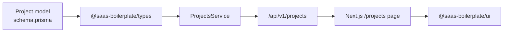

# Practical Workflow Lab — Model to API to Frontend

Hands-on exercises to learn the full development flow in this boilerplate. Work through the modules in order. Each module references the official docs and ends with **verification steps** you can run yourself.

> **Scope:** local development only — setup, database, API, frontend, and tests. Deployment is intentionally excluded.

**Suggested feature:** build a user-owned **Project** resource end-to-end. The dashboard already has a placeholder at `/projects`; you will replace it with real data from PostgreSQL via the Fastify API.

---

## Before you start


### Required reading


| Order | Document                                             | Why                                  |
| ----- | ---------------------------------------------------- | ------------------------------------ |
| 1     | [Getting Started](./setup/getting-started.md)        | Clone, env, Postgres, `pnpm dev`     |
| 2     | [Architecture Overview](./architecture/overview.md)  | How app, API, and packages connect   |
| 3     | [Database Layer](./features/database-layer.md)       | Prisma schema → shared types         |
| 4     | [API Architecture](./features/api-architecture.md)   | Routes, services, validation         |
| 5     | [Authentication](./features/authentication.md)       | JWT + protected routes               |
| 6     | [UI System](./features/ui-system.md)                 | shadcn/ui + Tailwind in the monorepo |
| 7     | [Monorepo Workflow](./features/monorepo-workflow.md) | Package boundaries                   |
| 8     | [Development Workflow](./setup/development.md)       | Daily commands                       |
| 9     | [Testing](./setup/testing.md)                        | Vitest patterns                      |


### What you will build




A `Project` belongs to a `User`. Authenticated users can list and create their own projects.

---


## Module 0 — Environment check

**Goal:** confirm the stack runs before adding features.

### Task 0.1 — Boot the monorepo

```bash
pnpm install
cp .env.example .env.development   # skip if already done
pnpm db:push
pnpm dev
```

**Verify:**


| Check          | Command / action                                    | Expected              |
| -------------- | --------------------------------------------------- | --------------------- |
| API health     | `curl http://localhost:8000/api/v1/health`          | `{"status":"ok",...}` |
| Frontend       | Open [http://localhost:3000](http://localhost:3000) | App loads             |
| Existing tests | `pnpm test`                                         | All tests pass        |


### Task 0.2 — Trace an existing request

Without changing code, answer these questions by reading the codebase:

1. Where is the Prisma schema defined?
2. Where does the API attach `fastify.prisma`?
3. How does the login form call the API? (file + HTTP method + path)
4. Why must the frontend **not** import `@saas-boilerplate/database`?

Write your answers in a personal notes file. Compare with [Database Layer](./features/database-layer.md) and [Monorepo Workflow](./features/monorepo-workflow.md).

**Pass criteria:** all four answers point to the correct paths/patterns described in the docs.

---


## Module 1 — Database model

**Read:** [Database Setup](./setup/database.md), [Database Layer](./features/database-layer.md)

**Reference patterns:** existing `User` model in `packages/database/prisma/schema.prisma`.

### Task 1.1 — Add the `Project` model

Edit `packages/database/prisma/schema.prisma` and add a `Project` model with at least:


| Field         | Type       | Notes                  |
| ------------- | ---------- | ---------------------- |
| `id`          | `String`   | `@id @default(cuid())` |
| `name`        | `String`   | Project title          |
| `description` | `String?`  | Optional               |
| `userId`      | `String`   | Foreign key to `User`  |
| `created_at`  | `DateTime` | `@default(now())`      |
| `updated_at`  | `DateTime` | `@updatedAt`           |


Add the relation on `User` (`projects Project[]`) and `Project` (`user User @relation(...)`).

### Task 1.2 — Apply schema and regenerate types

```bash
pnpm db:generate
pnpm db:push
```

**Verify:**

```bash
pnpm db:studio
```

- [ ] `Project` table exists in Prisma Studio
- [ ] `User` shows a relation to projects
- [ ] `packages/types/src/generated/prisma/client.ts` exports a `Project` type (search for `export type Project`)


### Task 1.3 — Boundary check (written)

Answer: *If you added* `import { prisma } from '@saas-boilerplate/database'` *inside* `apps/app`*, what would break the architecture?*

**Pass criteria:** you explain that the frontend must only talk to the API, not the database directly (see [Database Layer](./features/database-layer.md)).

---


## Module 2 — API layer

**Read:** [API Architecture](./features/api-architecture.md), [Authentication](./features/authentication.md)

**Reference patterns:**

- Route: `apps/api/src/routes/v1/users/actions.ts`
- Autohooks: `apps/api/src/routes/v1/users/autohooks.ts`
- Service: `apps/api/src/services/users.ts`
- Schema: `apps/api/src/schemas/v1/users.ts`


### Task 2.1 — Create `ProjectsService`

Create `apps/api/src/services/projects.ts` with a class that receives `prisma` via constructor (same pattern as `UsersService`).

Implement:


| Method                                                                 | Behavior                                                        |
| ---------------------------------------------------------------------- | --------------------------------------------------------------- |
| `listByUserId(userId: string)`                                         | Return all projects for that user, ordered by `created_at` desc |
| `create(userId: string, data: { name: string; description?: string })` | Create a project owned by the user                              |


Do **not** return passwords or unrelated user fields.

### Task 2.2 — Add JSON schemas

Create `apps/api/src/schemas/v1/projects.ts` with schemas for:

- `GET /` — response: array of projects (`id`, `name`, `description`, `created_at`)
- `POST /` — body: `name` (required string), `description` (optional string); response: created project

Follow the structure used in `apps/api/src/schemas/v1/users.ts` (tags, `4xx`, `500` blocks).

### Task 2.3 — Add routes

Create:

```
apps/api/src/routes/v1/projects/
  actions.ts
  autohooks.ts
```

`autohooks.ts`**:** apply `fastify.verifyToken` to all routes in this folder (copy the users pattern).

`actions.ts`**:** implement:


| Method | Path | Auth         | Handler                         |
| ------ | ---- | ------------ | ------------------------------- |
| `GET`  | `/`  | JWT required | List current user's projects    |
| `POST` | `/`  | JWT required | Create project for current user |


Use `request.loggedUser.id` from the auth plugin. Routes auto-load at `/api/v1/projects/` — no manual registration needed.

**Verify (manual, with a real token):**

```bash
# 1. Register or login to get a token
curl -s -X POST http://localhost:8000/api/v1/auth/login \
  -H "Content-Type: application/json" \
  -d '{"email":"you@example.com","password":"yourpassword"}'

# 2. List projects (replace TOKEN)
curl -s http://localhost:8000/api/v1/projects/ \
  -H "Authorization: Bearer TOKEN"

# 3. Create a project
curl -s -X POST http://localhost:8000/api/v1/projects/ \
  -H "Authorization: Bearer TOKEN" \
  -H "Content-Type: application/json" \
  -d '{"name":"My first project","description":"Lab exercise"}'
```

**Pass criteria:**

- [ ] `GET` without token returns `401`
- [ ] `GET` with token returns `200` and a JSON array
- [ ] `POST` creates a row visible in Prisma Studio linked to your user


### Task 2.4 — Service unit test

Create `apps/api/src/services/projects.test.ts`.

Test at least:

1. `listByUserId` calls `prisma.project.findMany` with the correct `where: { userId }`
2. `create` calls `prisma.project.create` with `userId` and input data

Mock Prisma the same way as `apps/api/src/services/authentication.test.ts`.

```bash
pnpm --filter @saas-boilerplate/api test
```

**Pass criteria:** new tests pass.

### Task 2.5 — Route integration test (optional stretch)

Using `buildTestApp` from `apps/api/src/test/build-test-app.ts`, add a test file that:

1. Mocks `prisma.project.findMany` to return one project
2. Calls `GET /api/v1/projects/` with a valid JWT (or mock `verifyToken` via overrides if needed)
3. Asserts `200` and the mocked payload

See `apps/api/src/test/health.test.ts` for the `app.inject()` pattern.

---


## Module 3 — Frontend layer

**Read:** [UI System](./features/ui-system.md), [Authentication](./features/authentication.md), [Development Workflow](./setup/development.md)

**Reference patterns:**

- API client: `apps/app/src/lib/api.ts`
- Redux thunk: `apps/app/src/features/auth/store/auth-slice.ts`
- Zod schemas: `apps/app/src/features/auth/schemas.ts`
- Page placeholder: `apps/app/src/app/(dashboard)/projects/page.tsx`


### Task 3.1 — Feature folder structure

Create:

```
apps/app/src/features/projects/
  schemas.ts
  types.ts
  api.ts          # thin wrappers around axios
  store/
    projects-slice.ts
```

`types.ts`**:** define a `Project` interface matching the API response (no password fields).

`schemas.ts`**:** Zod schema for create form — `name` (min 1 char), `description` (optional).

### Task 3.2 — Zod schema test

Create `apps/app/src/features/projects/schemas.test.ts`.

Mirror `apps/app/src/features/auth/schemas.test.ts`:

- [ ] Valid input passes
- [ ] Empty `name` fails
- [ ] Invalid data fails

```bash
pnpm --filter @saas-boilerplate/app test
```


### Task 3.3 — Wire API calls with auth

The shared axios instance in `apps/app/src/lib/api.ts` uses `NEXT_PUBLIC_API_URL`. Ensure requests to `/projects/` send the JWT.

**Exercise:** extend the API client or projects API module so authenticated requests include:

```
Authorization: Bearer <access_token>
```

Use the token from Redux (`selectAuth`) or session storage — follow how auth state is already persisted in `apps/app/src/lib/auth.ts`.

> **Hint:** you may add an axios request interceptor in `api.ts` or set headers per call in `features/projects/api.ts`. Do not store secrets in `NEXT_PUBLIC_`* variables.


### Task 3.4 — Redux slice

In `projects-slice.ts`, add async thunks:


| Thunk           | API call          |
| --------------- | ----------------- |
| `fetchProjects` | `GET /projects/`  |
| `createProject` | `POST /projects/` |


Handle `pending` / `fulfilled` / `rejected` states (loading + error), following `auth-slice.ts`.

Register the reducer in `apps/app/src/lib/store.ts`.

### Task 3.5 — Build the `/projects` page

Update `apps/app/src/app/(dashboard)/projects/page.tsx` to:

1. Fetch projects on mount (client component or client child)
2. Display a list (name + description) using `@saas-boilerplate/ui` components (`Card`, `Button`, `Input`, `Label`)
3. Provide a form to create a new project
4. Show loading and error states
5. Refresh the list after successful create

**UI requirements:**

- Import components from `@saas-boilerplate/ui/components/*` (not local copies)
- Use Tailwind utility classes consistent with the dashboard
- If you need a new shadcn component (e.g. `textarea`), install from `apps/app`:

```bash
cd apps/app
pnpm dlx shadcn@latest add textarea
```

**Verify in browser:**

1. Log in at [http://localhost:3000/login](http://localhost:3000/login)
2. Visit [http://localhost:3000/projects](http://localhost:3000/projects)
3. Create a project — it appears in the list
4. Refresh the page — data persists (loaded from API/DB)
5. Log out — visiting `/projects` redirects to `/login` (cookie guard in `proxy.ts`)

**Pass criteria:** full CRUD-read/create loop works in the UI without importing database packages in the app.

---


## Module 4 — End-to-end integration checklist

Run this final manual test script. Treat it like a QA checklist.


| Step | Action                                    | Expected                               |
| ---- | ----------------------------------------- | -------------------------------------- |
| 1    | `pnpm dev` running                        | No startup errors                      |
| 2    | Register a new user                       | Redirected to dashboard                |
| 3    | Open `/projects`                          | Empty state or list                    |
| 4    | Create "Alpha" project                    | Appears in UI                          |
| 5    | `curl` `GET /api/v1/projects/` with token | JSON contains "Alpha"                  |
| 6    | `pnpm db:studio`                          | Row exists with correct `userId`       |
| 7    | Register a **second** user                | —                                      |
| 8    | Second user lists projects                | Does **not** see first user's projects |
| 9    | `pnpm test`                               | All tests green                        |
| 10   | `pnpm lint`                               | No new lint errors                     |


### Task 4.1 — Data isolation reflection

Explain in your notes how the API enforces per-user data access. Point to the exact line(s) where `userId` is taken from the JWT rather than from the request body.

**Pass criteria:** you understand why `userId` must never come from client input on create/list.

---


## Module 5 — Monorepo and conventions quiz

Short answer exercises. No code required.

### Q1 — Package boundaries

Which imports are **allowed**?


| Import                       | App (`apps/app`) | API (`apps/api`) |
| ---------------------------- | ---------------- | ---------------- |
| `@saas-boilerplate/ui`       | ?                | ?                |
| `@saas-boilerplate/database` | ?                | ?                |
| `@saas-boilerplate/types`    | ?                | ?                |


### Q2 — Schema change workflow

Put these in the correct order for a local prototype:

- `pnpm db:push`
- Edit `schema.prisma`
- `pnpm db:generate`
- `pnpm build`


### Q3 — Route discovery

You created `apps/api/src/routes/v1/projects/actions.ts`. What is the full URL path for `fastify.get('/')` inside that file?

### Q4 — Auth layers

What does `apps/app/src/proxy.ts` check? What does `fastify.verifyToken` check? Why are both needed?

**Answers:** see [Monorepo Workflow](./features/monorepo-workflow.md), [Database Setup](./setup/database.md), [API Architecture](./features/api-architecture.md), [Authentication](./features/authentication.md).

---


## Module 6 — Stretch goals

Optional tasks if you want more practice. Not required to finish the lab.

### Stretch A — Production-ready migration

Replace `pnpm db:push` with a proper migration:

```bash
pnpm --filter @saas-boilerplate/database db:migrate:dev
```

Document the new folder under `packages/database/prisma/migrations/`.

### Stretch B — Update project

Add `PATCH /api/v1/projects/:id` and inline rename in the UI. Ensure users can only update their own projects.

### Stretch C — Delete project

Add `DELETE /api/v1/projects/:id` and a confirm button in the UI (use shadcn `alert-dialog`).

### Stretch D — Seed data

Add sample projects in `packages/database/src/seed/` for dev users. Run:

```bash
pnpm --filter @saas-boilerplate/database db:seed:dev
```


### Stretch E — OpenAPI

With the API running, open [http://localhost:8000/docs](http://localhost:8000/docs) and confirm your projects routes appear in Swagger.

---


## Submission checklist

Use this when you consider the lab complete:

- [ ] `Project` model in Prisma with `User` relation
- [ ] `pnpm db:generate` and `pnpm db:push` succeeded
- [ ] `ProjectsService` with tests
- [ ] `/api/v1/projects/` `GET` + `POST` protected by JWT
- [ ] Zod schema + tests in the app
- [ ] Redux slice registered and used on `/projects`
- [ ] UI built with `@saas-boilerplate/ui` components
- [ ] Manual E2E checklist (Module 4) passed
- [ ] `pnpm test` and `pnpm lint` pass
- [ ] No `@saas-boilerplate/database` import in `apps/app`

---


## Troubleshooting


| Problem                             | Doc / fix                                                                                |
| ----------------------------------- | ---------------------------------------------------------------------------------------- |
| Types not found after schema change | [Database Setup — Types out of sync](./setup/database.md)                                |
| Route 404                           | Folder must be `routes/v1/projects/actions.ts`; restart API                              |
| 401 on API calls                    | Missing or expired `Authorization` header                                                |
| Unstyled UI components              | Check `@source` in `apps/app/src/app/globals.css` — [UI System](./features/ui-system.md) |
| `db:push` data loss warning         | Review diff; reset local DB if safe — [Database Setup](./setup/database.md)              |
| Tests fail after API changes        | Run `pnpm build` first — Turbo `test` depends on `^build`                                |


---


## File map (what you should have touched)

```
packages/database/prisma/schema.prisma          # Project model
apps/api/src/services/projects.ts               # Business logic
apps/api/src/services/projects.test.ts          # Service tests
apps/api/src/schemas/v1/projects.ts               # JSON Schema
apps/api/src/routes/v1/projects/actions.ts        # HTTP handlers
apps/api/src/routes/v1/projects/autohooks.ts      # JWT guard
apps/app/src/features/projects/                   # Feature module
apps/app/src/app/(dashboard)/projects/page.tsx    # UI page
apps/app/src/lib/store.ts                         # Register reducer
```

---


## Related documentation

- [Documentation index](./README.md)
- [Getting Started](./setup/getting-started.md)
- [Development Workflow](./setup/development.md)
- [Testing](./setup/testing.md)

*Deployment (Kubernetes, ArgoCD, Docker images) is documented in [Deployment](./setup/deployment.md) but is outside the scope of this lab.*