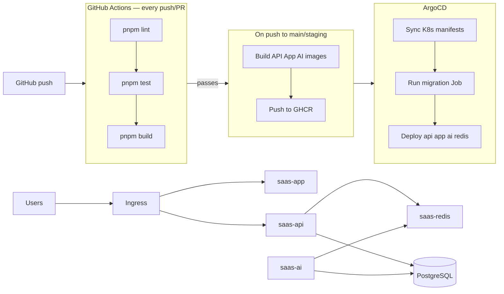

# Deployment

Guide for building and deploying the boilerplate to staging and production.

**Repository:** [github.com/Khalil-Bchir/full-stack-saas-boilerplate](https://github.com/Khalil-Bchir/full-stack-saas-boilerplate)

Deployment uses **GitHub Actions** (CI) + **Kubernetes + ArgoCD** (GitOps CD). Manifests live in [`deploy/`](../../deploy/README.md).

## CI/CD pipeline



Workflow: [`.github/workflows/ci.yml`](../../.github/workflows/ci.yml)

| Job | Trigger | Steps |
| --- | --- | --- |
| **Lint, Test & Build** | Every push / PR to `main` or `staging` | `pnpm lint` → `pnpm test` → `pnpm build` |
| **Publish Docker Images** | Push to `main` or `staging` (after CI passes) | Build & push API + App + AI images to GHCR |

### Image tags pushed by CI

| Branch | Tag | SHA tag |
| --- | --- | --- |
| `staging` | `staging` | `<commit-sha>` |
| `main` | `production` | `<commit-sha>` |

ArgoCD deploys the `staging` / `production` tags from GHCR. Deployments use `imagePullPolicy: Always` so new image pushes are picked up on rollout.

---

| Package | Output | Command |
| --- | --- | --- |
| `@saas-boilerplate/app` | `.next/` | `pnpm build --filter=@saas-boilerplate/app` |
| `@saas-boilerplate/api` | `apps/api/dist/` | `pnpm build:api` |
| `@saas-boilerplate/database` | `packages/database/dist/` | `pnpm build --filter=@saas-boilerplate/database` |
| `@saas-boilerplate/types` | `packages/types/dist/` | `pnpm build --filter=@saas-boilerplate/types` |

Full monorepo build:

```bash
pnpm test
pnpm build
```

---

## Container images

Images are published to GitHub Container Registry:

| Image | Dockerfile |
| --- | --- |
| `ghcr.io/khalil-bchir/saas-boilerplate-api` | `apps/api/Dockerfile` |
| `ghcr.io/khalil-bchir/saas-boilerplate-app` | `apps/app/Dockerfile` |
| `ghcr.io/khalil-bchir/saas-boilerplate-ai` | `apps/ai/Dockerfile` |

Redis uses the public `redis:7.4-alpine` image via `deploy/k8s/base/redis/`.

### Build and push (staging)

```bash
docker login ghcr.io -u Khalil-Bchir
docker build -t ghcr.io/khalil-bchir/saas-boilerplate-api:staging -f apps/api/Dockerfile .
docker build -t ghcr.io/khalil-bchir/saas-boilerplate-app:staging -f apps/app/Dockerfile .
docker build -t ghcr.io/khalil-bchir/saas-boilerplate-ai:staging -f apps/ai/Dockerfile apps/ai
docker push ghcr.io/khalil-bchir/saas-boilerplate-api:staging
docker push ghcr.io/khalil-bchir/saas-boilerplate-app:staging
docker push ghcr.io/khalil-bchir/saas-boilerplate-ai:staging
```

### Build and push (production)

```bash
docker build -t ghcr.io/khalil-bchir/saas-boilerplate-api:production -f apps/api/Dockerfile .
docker build -t ghcr.io/khalil-bchir/saas-boilerplate-app:production -f apps/app/Dockerfile .
docker build -t ghcr.io/khalil-bchir/saas-boilerplate-ai:production -f apps/ai/Dockerfile apps/ai
docker push ghcr.io/khalil-bchir/saas-boilerplate-api:production
docker push ghcr.io/khalil-bchir/saas-boilerplate-app:production
docker push ghcr.io/khalil-bchir/saas-boilerplate-ai:production
```

---

## Environment files

| File | Purpose |
| --- | --- |
| `.env.staging.example` | Staging template |
| `.env.production.example` | Production template |

Copy and use locally:

```bash
cp .env.staging.example .env.staging
cp .env.production.example .env.production
```

### Staging URLs (Kubernetes Ingress)

| Service | Host |
| --- | --- |
| Frontend | `https://staging.saas-boilerplate.io` |
| API | `https://api.staging.saas-boilerplate.io` |

`NEXT_PUBLIC_API_URL=https://api.staging.saas-boilerplate.io/api/v1`

### Production URLs (Kubernetes Ingress)

| Service | Host |
| --- | --- |
| Frontend | `https://app.saas-boilerplate.io` |
| API | `https://api.saas-boilerplate.io` |

`NEXT_PUBLIC_API_URL=https://api.saas-boilerplate.io/api/v1`

---

## Kubernetes bootstrap

### 1. Create secrets

```bash
chmod +x deploy/scripts/bootstrap-secrets.sh
./deploy/scripts/bootstrap-secrets.sh saas-staging .env.staging.example
./deploy/scripts/bootstrap-secrets.sh saas-production .env.production.example
```

### 2. Apply manifests

```bash
kubectl apply -k deploy/k8s/overlays/staging
kubectl -n saas-staging wait --for=condition=complete job/saas-api-migrate --timeout=120s
```

Production:

```bash
kubectl apply -k deploy/k8s/overlays/production
kubectl -n saas-production wait --for=condition=complete job/saas-api-migrate --timeout=120s
```

---

## ArgoCD (GitOps)

Repository URL configured in manifests:

`https://github.com/Khalil-Bchir/full-stack-saas-boilerplate.git`

### Install ArgoCD

```bash
kubectl create namespace argocd
kubectl apply -n argocd -f https://raw.githubusercontent.com/argoproj/argo-cd/stable/manifests/install.yaml
```

### Bootstrap applications

```bash
kubectl apply -f deploy/argocd/projects/
kubectl apply -f deploy/argocd/app-of-apps.yaml
```

| ArgoCD Application | Branch | Overlay |
| --- | --- | --- |
| `saas-staging` | `staging` | `deploy/k8s/overlays/staging` |
| `saas-production` | `main` | `deploy/k8s/overlays/production` |

See [deploy/argocd/README.md](../../deploy/argocd/README.md).

---

## Local production start

```bash
cp .env.production.example .env.production
pnpm build
pnpm start
```

API only:

```bash
pnpm build:api
pnpm --filter @saas-boilerplate/api start
```

---

## Database migrations

Local or CI:

```bash
pnpm --filter @saas-boilerplate/database db:migrate:staging
pnpm --filter @saas-boilerplate/database db:migrate:prod
```

Kubernetes Job: `deploy/k8s/base/api/migration-job.yaml`

---

## Pre-deploy checklist

- [ ] `pnpm test` passes
- [ ] `pnpm build` succeeds
- [ ] Images pushed to `ghcr.io/khalil-bchir/`
- [ ] Secrets created in `saas-staging` / `saas-production`
- [ ] `ACCESS_TOKEN_SECRET` and `COOKIE_SECRET` are unique per environment
- [ ] `DATABASE_URL` points to the correct database
- [ ] `NEXT_PUBLIC_API_URL` matches the Ingress API host
- [ ] Migrations completed
- [ ] ArgoCD applications are synced
