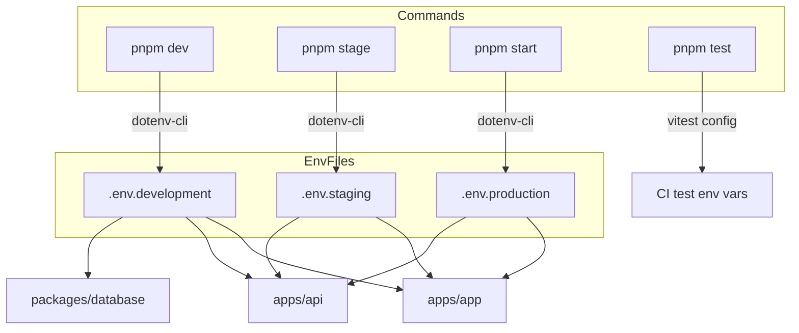
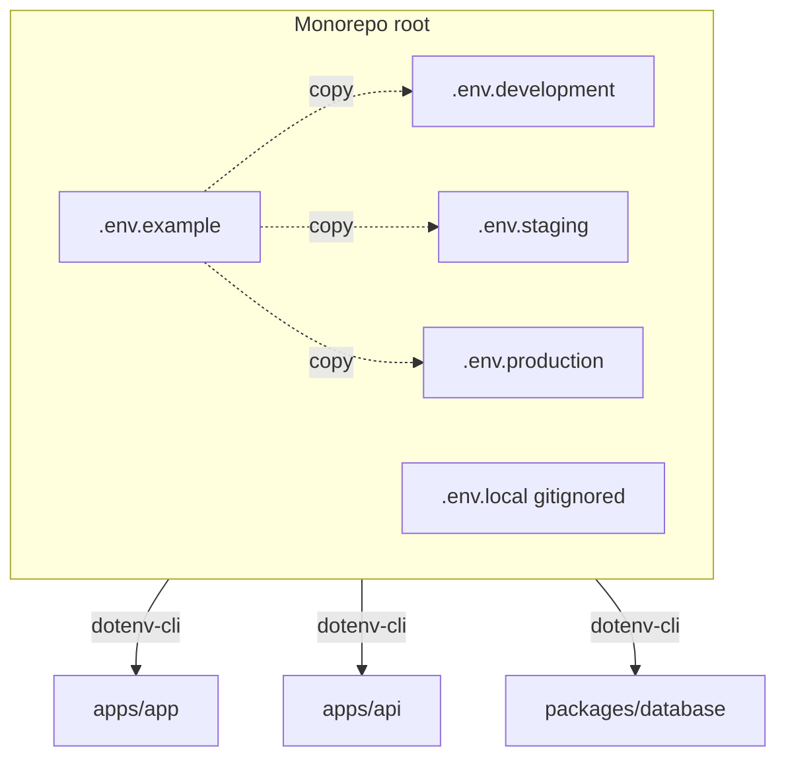

# Environments & NODE_ENV

How this monorepo selects, loads, and applies environment configuration across **development**, **staging**, and **production**.

**Repository:** [github.com/Khalil-Bchir/full-stack-saas-boilerplate](https://github.com/Khalil-Bchir/full-stack-saas-boilerplate)

> See also: [Environment Variables](./environment-variables.md) for the full variable reference.

## Environment command flow



---

## Core concept

This boilerplate uses **explicit env files at the monorepo root**, loaded by **`dotenv-cli`** in each workspace's npm scripts. It does **not** rely on Next.js or Node to guess which file to read.



Each env file **must** set `NODE_ENV` to match the environment it represents:

| File | `NODE_ENV` value |
| --- | --- |
| `.env.development` | `development` |
| `.env.staging` | `staging` |
| `.env.production` | `production` |

---

## How to run each environment

### Development (default)

```bash
cp .env.example .env.development   # first time only
pnpm dev
```

**What loads:**

| Workspace | Script | Env files loaded |
| --- | --- | --- |
| Root (Turbo) | `dotenv -e .env -e .env.development -- turbo run dev` | `.env` (optional) → `.env.development` |
| App | `dotenv -e ../../.env -e ../../.env.development -- next dev` | same |
| API | `dotenv -e ../../.env.development -- tsx watch …` | `.env.development` |
| Database | `dotenv -e ../../.env.development -- prisma …` | `.env.development` |

Later values override earlier ones when multiple files are passed.

### Staging

Use the staging env file explicitly:

```bash
# API against staging config
pnpm --filter @saas-boilerplate/api stage

# All workspaces on staging
pnpm stage

# Database migrations (staging)
pnpm --filter @saas-boilerplate/database db:migrate:staging

# Seed staging
pnpm --filter @saas-boilerplate/database db:seed:staging
```

Ensure `.env.staging` exists with `NODE_ENV=staging` and staging-specific URLs/secrets.

### Production

```bash
# Build frontend with production public vars
pnpm build --filter=@saas-boilerplate/app
# loads: .env + .env.production

# Start API
pnpm --filter @saas-boilerplate/api start
# loads: .env.production

# Apply migrations
pnpm --filter @saas-boilerplate/database db:migrate:prod
```

---

## NODE_ENV — what it controls

`NODE_ENV` is a normal env var in your `.env.*` files. Scripts load the file **first**, then the process reads `process.env.NODE_ENV`.

### API (`apps/api`)

| `NODE_ENV` | Behavior |
| --- | --- |
| `development` | Pretty logs via `pino-pretty` |
| `staging` | Pretty logs (treated as non-production) |
| `production` | Structured JSON logs, no pretty printing |

Source: `apps/api/src/index.ts`

```ts
const isDevelopment = process.env.NODE_ENV !== 'production';
```

Swagger server URL also switches on `NODE_ENV` in `apps/api/src/plugins/swagger.ts`.

### Database (`packages/database`)

| `NODE_ENV` | Behavior |
| --- | --- |
| Not `production` | Prisma client cached on `globalThis` (safe hot reload in dev) |
| `production` | New client instance per process |

Source: `packages/database/src/client.ts`

### Next.js app (`apps/app`)

Next.js **also** sets `NODE_ENV` internally:

- `next dev` → `development`
- `next build` / `next start` → `production`

Your `.env.development` / `.env.production` files still matter for **`NEXT_PUBLIC_*`** vars, which are inlined at build time via `dotenv-cli` in the build script.

### Turbo cache

`NODE_ENV` is listed in `turbo.json` → `globalEnv`. Changing it invalidates cached builds across workspaces.

---

## File layout & load order

### Tracked files

| File | Purpose |
| --- | --- |
| `.env.example` | Documented template — copy to create env files |
| `.env.development` | Local development defaults |
| `.env.staging` | Staging server values |
| `.env.production` | Production server values |

### Gitignored (recommended for secrets)

| File | Purpose |
| --- | --- |
| `.env.local` | Machine-specific overrides (all environments) |
| `.env.development.local` | Dev secrets that override `.env.development` |
| `.env.production.local` | Prod secrets on deploy machines |

Pattern in `.gitignore`: `.env*` with `!.env.example` only.

### Optional shared base file

Create a root `.env` for values shared across **all** environments (non-secret defaults):

```env
# .env (optional, not committed if it has secrets)
SERVER_PORT=8000
ACCESS_TOKEN_TTL=1d
```

Root dev script loads `.env` **before** `.env.development`, so environment-specific files can override shared values.

---

## Per-workspace env loading reference

### Root `package.json`

```json
"dev": "dotenv -e .env -e .env.development -- turbo run dev"
"stage": "dotenv -e .env -e .env.staging -- turbo run stage"
"test": "turbo run test"
```

### App `apps/app/package.json`

```json
"dev":   "dotenv -e ../../.env -e ../../.env.development -- next dev"
"stage": "dotenv -e ../../.env -e ../../.env.staging -- next dev"
"test":  "vitest run"
"build": "dotenv -e ../../.env -e ../../.env.production -- next build"
```

### API `apps/api/package.json`

```json
"dev":   "dotenv -e ../../.env.development -- tsx watch src/index.ts"
"stage": "dotenv -e ../../.env -e ../../.env.staging -- tsx watch src/index.ts"
"test":  "vitest run"
"start": "dotenv -e ../../.env.production -- node dist/index.js"
```

### Database `packages/database/package.json`

All `db:*` scripts load the matching env file:

| Script suffix | Env file |
| --- | --- |
| `*:dev`, `db:push`, `db:studio` | `.env.development` |
| `*:staging` | `.env.staging` |
| `*:prod` | `.env.production` |

---

## Setup checklist (first clone)

```bash
git clone https://github.com/Khalil-Bchir/full-stack-saas-boilerplate.git
cd full-stack-saas-boilerplate

cp .env.example .env.development
cp .env.staging.example .env.staging
cp .env.production.example .env.production
```

---

## Common mistakes

### Setting NODE_ENV in the shell without loading the env file

```bash
# Wrong — DATABASE_URL and secrets won't be loaded
NODE_ENV=production pnpm --filter @saas-boilerplate/api start
```

```bash
# Correct — use the script that loads .env.production
pnpm --filter @saas-boilerplate/api start
```

### Mismatch between file name and NODE_ENV value

If `.env.development` contains `NODE_ENV=production`, dev tooling (pretty logs, Prisma caching) will behave inconsistently. **Always keep them aligned.**

### Expecting Next.js to load root env files automatically

Next.js only auto-loads `.env*` files **inside `apps/app/`**. This monorepo keeps env at the **repo root** and injects them via `dotenv-cli`. Do not move env files into `apps/app/` unless you update all scripts.

### Building the app with development API URL

`pnpm build` for the app loads `.env.production`. Ensure `NEXT_PUBLIC_API_URL` points to your production API before building for deploy.

### Running Prisma without an env file

`prisma.config.ts` falls back to a hardcoded local URL if `DATABASE_URL` is missing. Always run db commands through the package scripts so the correct env file is loaded.

---

## Adding a new environment variable

1. Add to `.env.example` with a comment
2. Add to `.env.development`, `.env.staging`, `.env.production` as needed
3. If it affects Turbo cache, add to `turbo.json` → `globalEnv`
4. Read via `process.env.MY_VAR` in code
5. For browser access, prefix with `NEXT_PUBLIC_`

---

## Quick reference

| I want to… | Command |
| --- | --- |
| Run local dev | `pnpm dev` |
| Run staging (app + api) | `pnpm stage` |
| Run unit tests | `pnpm test` |
| Run production (app + api) | `pnpm start` |
| Run API on staging config | `pnpm --filter @saas-boilerplate/api stage` |
| Run API in production mode | `pnpm --filter @saas-boilerplate/api start` |
| Build app for production | `pnpm build --filter=@saas-boilerplate/app` |
| Push schema (dev DB) | `pnpm db:push` |
| Migrate staging DB | `pnpm --filter @saas-boilerplate/database db:migrate:staging` |
| Migrate production DB | `pnpm --filter @saas-boilerplate/database db:migrate:prod` |
