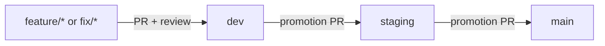
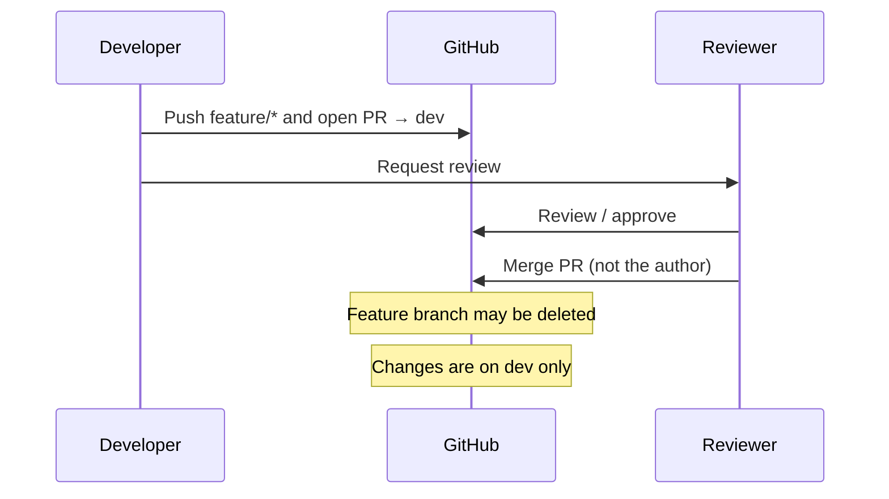
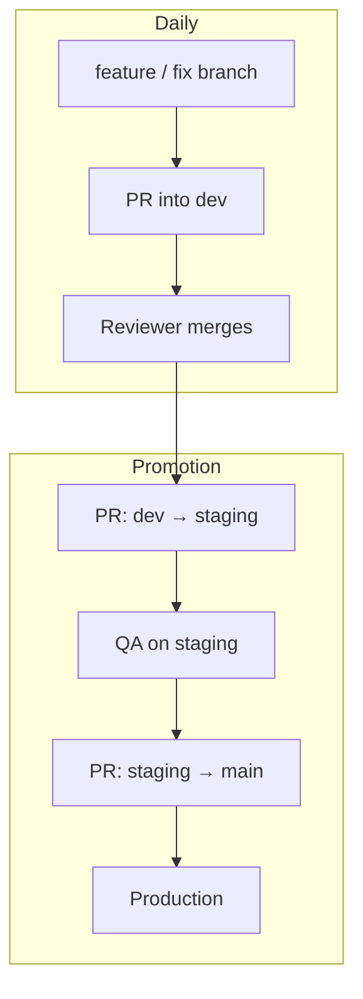

# Pull request & merge flow

How code moves from a developer branch into production on **Matchy+**.

This is a **free private** GitHub repository, so we cannot turn on branch-protection rules. The flow below is enforced by process (social contract) plus optional CI later. See also [CONTRIBUTING.md](../CONTRIBUTING.md).

## The four branch kinds

| Branch | Who commits here? | Role |
| --- | --- | --- |
| `feature/*` or `fix/*` | One developer | Isolated work |
| `dev` | Via PR only | Team integration |
| `staging` | Via promotion PR only | QA / pre-production |
| `main` | Via promotion PR only | Production |



**Never push straight to `dev`, `staging`, or `main`.** Always open a pull request.

## Social contract (must follow)

1. Open a PR for every change that lands on `dev`, `staging`, or `main`.
2. **Do not merge your own PR.** A teammate reviews and merges.
3. Features/fixes target **`dev` only** — never open a feature PR into `main`.
4. Promotion is always **one hop**: `dev` → `staging`, then `staging` → `main`.
5. Run local checks before asking for merge (`pnpm lint`, `pnpm test`). CI is temporarily disabled.

GitHub may show banners like “`dev` is N commits ahead of `main`” and offer **Compare & pull request**. That is normal after merges into `dev`. Do **not** use that shortcut to jump `dev` → `main`; use the promotion steps below.

## Path A — Daily feature / fix work

### 1. Branch from latest `dev`

```bash
git checkout dev
git pull origin dev
git checkout -b feature/short-description
# or: git checkout -b fix/short-description
```

### 2. Develop and verify

```bash
pnpm install   # if needed
pnpm lint
pnpm test
```

Commit with the project convention (`pnpm commit` / conventional commits).

### 3. Push and open a PR into `dev`

```bash
git push -u origin HEAD
```

On GitHub: **compare `feature/...` → `dev`** (not `main`).

Fill the [PR template](../.github/pull_request_template.md):

- Summary and ticket link  
- Target-branch checkbox for `feature/*` → `dev`  
- Checklist  
- Remember: **do not self-merge**

### 4. Review and merge

| Role | Action |
| --- | --- |
| Author | Respond to review, push fixes |
| Reviewer | Approve and **merge** when ready |
| Author | Delete the feature branch after merge (GitHub checkbox is fine) |

After merge, the feature lives on `dev`. It is **not** in staging or production yet.



## Path B — Promote to staging (QA)

When `dev` has a set of changes ready to test in staging:

1. Open a PR: **`dev` → `staging`**.
2. Title/body should say this is a **promotion** (use the template’s staging checkbox).
3. A teammate (or release owner) reviews and merges.
4. Verify the staging environment / behaviour.

Do not add unrelated commits on the promotion PR; it should only bring `dev` forward into `staging`.

## Path C — Promote to production

When staging is verified:

1. Open a PR: **`staging` → `main`**.
2. Get explicit approval from a release owner.
3. A reviewer merges.
4. Confirm production looks healthy.



## What each PR type should look like

| PR | Base ← Head | Who opens | Who merges |
| --- | --- | --- | --- |
| Feature / fix | `dev` ← `feature/*` or `fix/*` | Author | **Someone else** |
| Staging promotion | `staging` ← `dev` | Anyone / release owner | Prefer non-author |
| Production promotion | `main` ← `staging` | Release owner | Prefer non-author |

## Example we already ran (smoke test)

This end-to-end path was exercised once on the repo:

1. `feature/workflow-smoke-test` → `dev` (PR #1)  
2. `dev` → `staging` (PR #2)  
3. `staging` → `main` (PR #3)  

That proved the branch topology and PR template. Real product work should follow the same shapes, with a different person merging when possible.

## Common GitHub UI situations

| You see | Meaning | Do this |
| --- | --- | --- |
| “`dev` had recent pushes” / Compare & pull request | `dev` moved; GitHub offers a PR vs default branch | Ignore unless you intentionally want a promotion; never skip to `main` for features |
| “This branch is N commits ahead of `main`” while viewing `dev` | Integration work has not been promoted yet | Promote via `dev` → `staging` → `main` when ready |
| Merge button available on your own PR | Free private repo — GitHub will not block you | **Do not click it**; ask a teammate |

## Checklist before you ask for a merge

- [ ] Correct base branch (`dev` for features; promotion only for the hops above)  
- [ ] PR template filled (summary, ticket, checkboxes)  
- [ ] Local lint/tests run  
- [ ] Reviewer requested  
- [ ] You will **not** merge it yourself  

## Related docs

- [CONTRIBUTING.md](../CONTRIBUTING.md) — short social-contract rules  
- [Development Workflow](./development.md) — daily commands  
- [Getting Started](./getting-started.md) — clone and run the stack  
