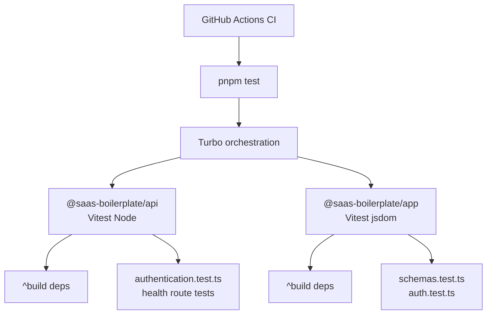
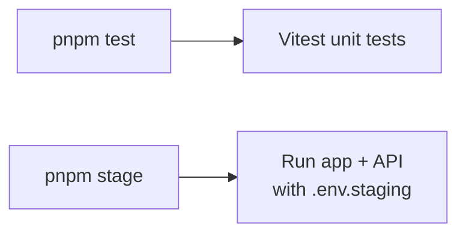

# Testing

Unit tests use [Vitest](https://vitest.dev/) in each app workspace.

**Repository:** [github.com/Khalil-Bchir/full-stack-saas-boilerplate](https://github.com/Khalil-Bchir/full-stack-saas-boilerplate)

## Test pipeline

## Commands

| Command | Description |
| --- | --- |
| `pnpm test` | Run all workspace tests via Turbo |
| `pnpm --filter @saas-boilerplate/api test` | API tests only |
| `pnpm --filter @saas-boilerplate/app test` | App tests only |
| `pnpm --filter @saas-boilerplate/api test:watch` | API watch mode |
| `pnpm --filter @saas-boilerplate/app test:watch` | App watch mode |

## API (`apps/api`)

- **Runner:** Vitest (Node environment)
- **Config:** `apps/api/vitest.config.ts`
- **Pattern:** `src/**/*.test.ts`

Example areas covered:

- `src/services/authentication.test.ts` — auth service with mocked Prisma
- `src/routes/v1/actions.test.ts` — health route with `fastify.inject()`

Test env vars are set in `vitest.config.ts` so `config.ts` loads without a real `.env` file.

## App (`apps/app`)

- **Runner:** Vitest + jsdom
- **Config:** `apps/app/vitest.config.ts`
- **Pattern:** `src/**/*.test.ts`, `src/**/*.test.tsx`

Example areas covered:

- `src/features/auth/schemas.test.ts` — Zod validation schemas
- `src/lib/auth.test.ts` — cookie and session helpers

## Adding tests

1. Create `*.test.ts` or `*.test.tsx` next to the code under test
2. Run `pnpm test` from the repo root
3. Turbo caches test results when inputs are unchanged

## Staging vs tests

| Command | Purpose |
| --- | --- |
| `pnpm test` | Run unit tests |
| `pnpm stage` | Run app + API against `.env.staging` |

Do not confuse `test` (unit tests) with `stage` (staging environment).
