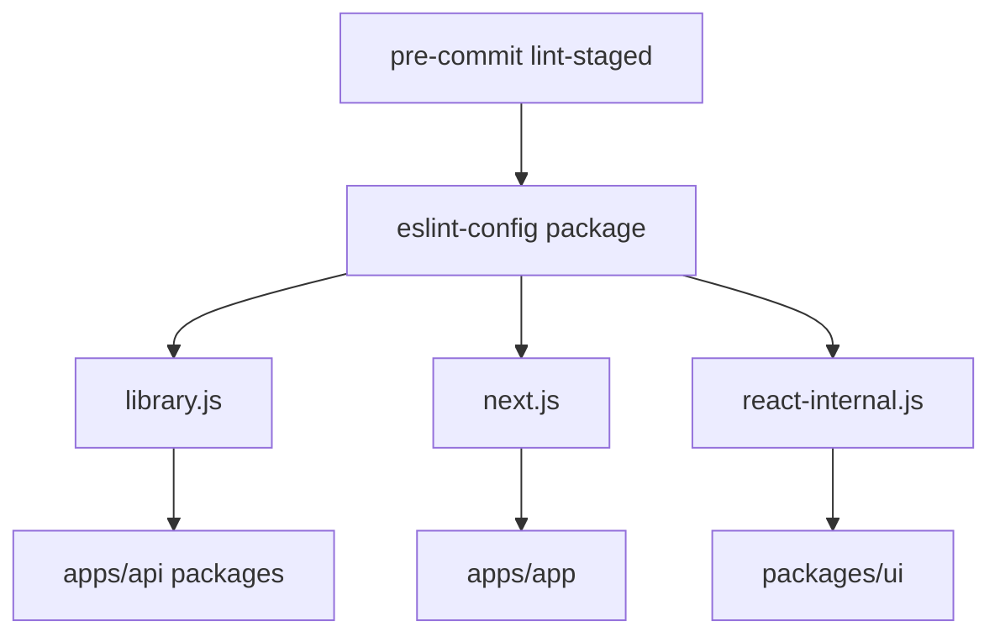

# @saas-boilerplate/eslint-config

Shared ESLint configurations for the monorepo.

## Config usage



## Configs

| File | Purpose |
| --- | --- |
| `library.js` | General TypeScript packages |
| `next.js` | Next.js app (legacy flat config) |
| `react-internal.js` | React library packages (UI) |

## Usage

### Next.js app

The app uses `eslint-config-next` directly in `apps/app/eslint.config.mjs`:

```js
import nextVitals from 'eslint-config-next/core-web-vitals';
```

### React library packages

Extend `react-internal.js` for shared component packages like `@saas-boilerplate/ui`.

### Node/API packages

Use `library.js` for TypeScript-only packages.

## Lint entire repo

```bash
pnpm lint
```

Pre-commit hook runs lint-staged on changed files.

## Related

- Prettier: `@saas-boilerplate/prettier-config`
- TypeScript: `@saas-boilerplate/typescript-config`
