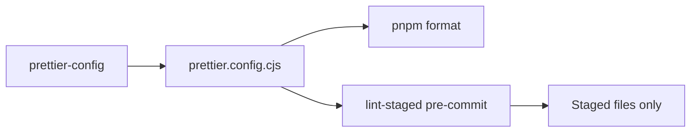

# @saas-boilerplate/prettier-config

Shared Prettier configuration for the monorepo.

## Format flow



## Usage

Reference in root `prettier.config.cjs`:

```js
module.exports = require('@saas-boilerplate/prettier-config');
```

Or in a workspace `package.json`:

```json
{
  "prettier": "@saas-boilerplate/prettier-config"
}
```

## Format entire repo

```bash
pnpm format
```

Runs via lint-staged on pre-commit for staged files.
