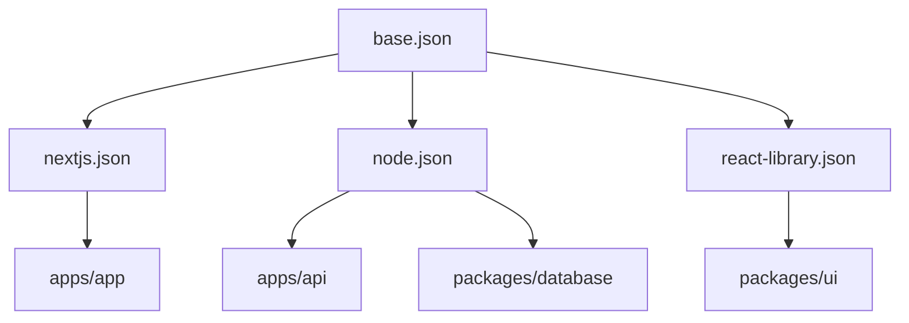

# @saas-boilerplate/typescript-config

Shared TypeScript configurations for all workspaces.

## Config hierarchy



## Configs

| File | Extends | Used by |
| --- | --- | --- |
| `base.json` | — | All packages (via other configs) |
| `nextjs.json` | `base.json` | Next.js app |
| `node.json` | `base.json` | API, database |
| `react-library.json` | `base.json` | UI package |

## Usage

In a workspace `tsconfig.json`:

```json
{
  "extends": "@saas-boilerplate/typescript-config/nextjs.json",
  "compilerOptions": {
    "paths": { "@/*": ["./src/*"] }
  }
}
```

## base.json highlights

- `strict: true`
- `module: NodeNext` / `moduleResolution: NodeNext`
- `target: ES2022`
- `noUncheckedIndexedAccess: true`

## Overrides

Workspaces can override in their own `tsconfig.json`. Example from UI package:

```json
{
  "compilerOptions": {
    "module": "ESNext",
    "moduleResolution": "bundler",
    "resolvePackageJsonImports": true
  }
}
```

Required for `package.json#imports` (`#components/*` aliases).
